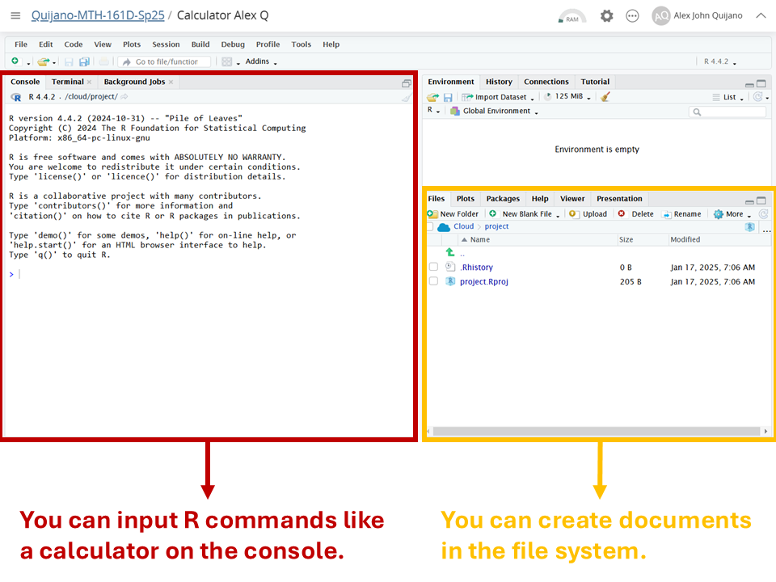
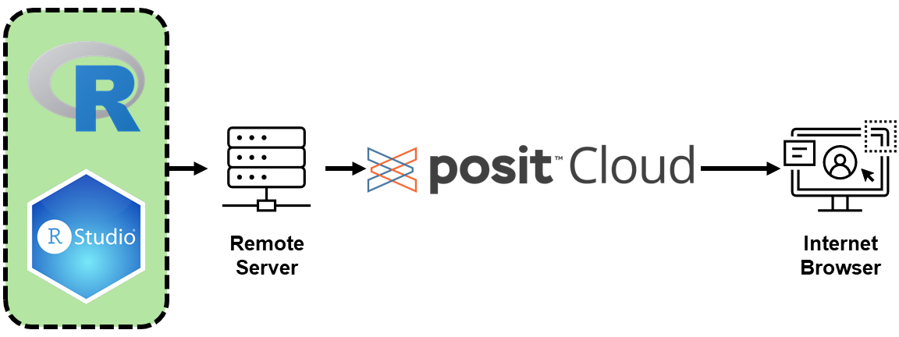
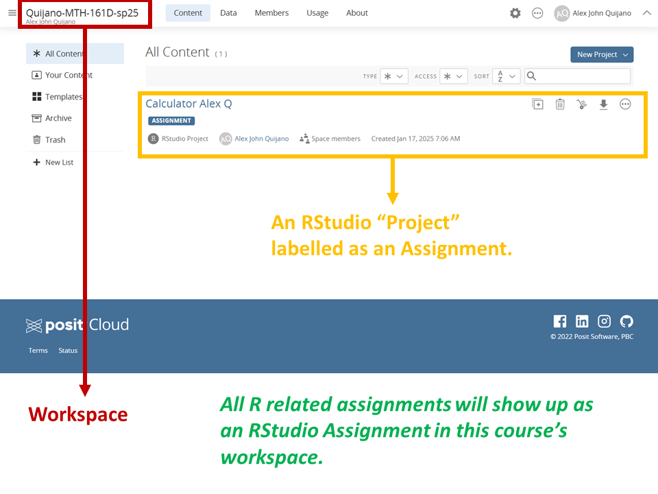

```{r setup, include=FALSE}
knitr::opts_chunk$set(echo = FALSE)
```

## Objectives

:::: {.column width=15%}
::::

:::: {.column width=70%}
- **Introduce R and R Studio**
- **Introduce the Posit Cloud**
- **Activity: Setting up Posit Cloud**
::::

:::: {.column width=15%}
::::

## Previously...

The guiding principle of applied statistics is statistical thinking.

```{r statistical-thinking-1, echo=FALSE, fig.cap="Statistical Thinking in the Data Science Life Cycle", fig.align='center', out.width = '55%'}
knitr::include_graphics("statistical-thinking-in-data-science-lifecycle.png")
```

## R as a Tool for Statistics

### Why R?

:::: {.column width=1%}
::::

:::: {.column width=48%}
* **Open-source and Free:** Accessible to everyone.
* **Designed for Statistics:** Built with statistical analysis in mind.
::::

:::: {.column width=48%}
* **Extensive Libraries:** Thousands of packages available.
* **Data Visualization:** Easy and powerful plotting capabilities.
* **Active Community:** Help is just a forum post away.
::::

:::: {.column width=1%}
::::

## RStudio, a User-Friendly Interface

### What is R Studio?

:::: {.column width=1%}
::::

:::: {.column width=48%}
**Integrated Development Environment (IDE):** Built specifically for R.

**Cross-Platform:** Available on Windows, macOS, and Linux.
::::

:::: {.column width=48%}
**User-Friendly:** Simplifies coding, debugging, and visualizations.

**Enhanced Productivity:** Tools for managing projects, data, and outputs.
::::

:::: {.column width=1%}
::::

## Basic Parts of R Studio

```{r rstudio-1, echo=FALSE, fig.cap="Basic Parts of R Studio", fig.align='center', out.width = '50%'}

```

## Posit Cloud, a Cloud-Based Solution

:::: {.column width=1%}
::::

:::: {.column width=48%}
### What is Posit Cloud?
* **Cloud-Based Platform:** Accessible from any device with an internet connection.
* **Developed by Posit (formerly RStudio):** Tailored for statistics and data science.
* **No Installation Needed:** Run R and RStudio directly in your browser.
::::

:::: {.column width=48%}
### Why Use Posit Cloud?
* **Convenience:** No installation required; access RStudio instantly through the internet.
* **Consistency:** Same environment across devices.
* **Collaboration:** Share projects with students and instructors easily.
* **Cost-Effective:** Free tier available with premium options for advanced features.
::::

:::: {.column width=1%}
::::

## How Posit Cloud Works?

```{r posit-cloud-network, echo=FALSE, fig.cap="Posit Cloud Computing", fig.align='center', out.width = '75%'}

```

## Basic Parts of Posit Cloud

```{r posit-cloud-1, echo=FALSE, fig.cap="Basic Parts of Posit Cloud", fig.align='center', out.width = '50%'}

```

## Activity: Setting up Posit Cloud

1. Sign-up for a free [Posit Cloud](https://login.posit.cloud/){target="_blank"} account using your UP email. Then, log-in.
2. Enter your email again using this form - [Email Entry for Activity: Setting up Posit Cloud](https://forms.office.com/r/8Rm8Ni7aDG?origin=lprLink){target="_blank"} so I can add you to the course's workspace. You will be invited to this course's Workspace soon. Check your email.
3. Enter the Workspace using the link in the email sent from Posit Cloud, then click on the assignment named *Calculator [First name][Last initial]*. This will create a copy for you.
4. Rename your copied assignment as *Calculator [First name][Last initial]*.
5. For now you can explore Posit Cloud. We will discuss more about this tool as we progress.

## References

::: {#refs}
:::
