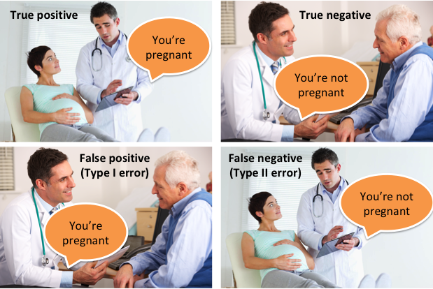
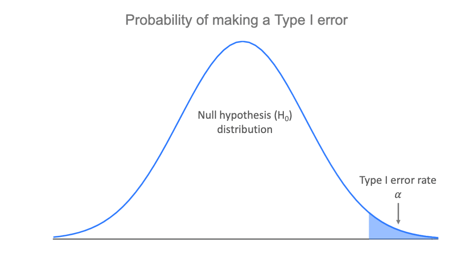
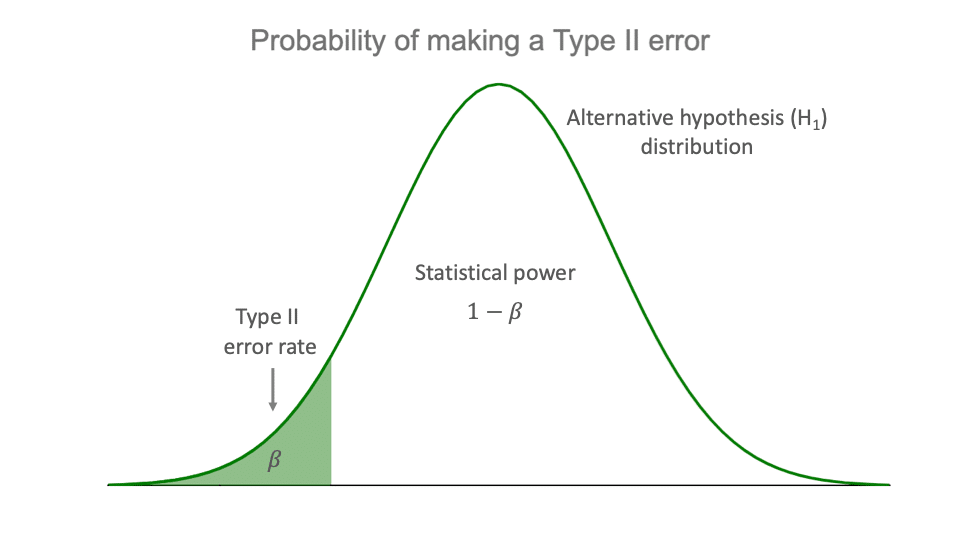
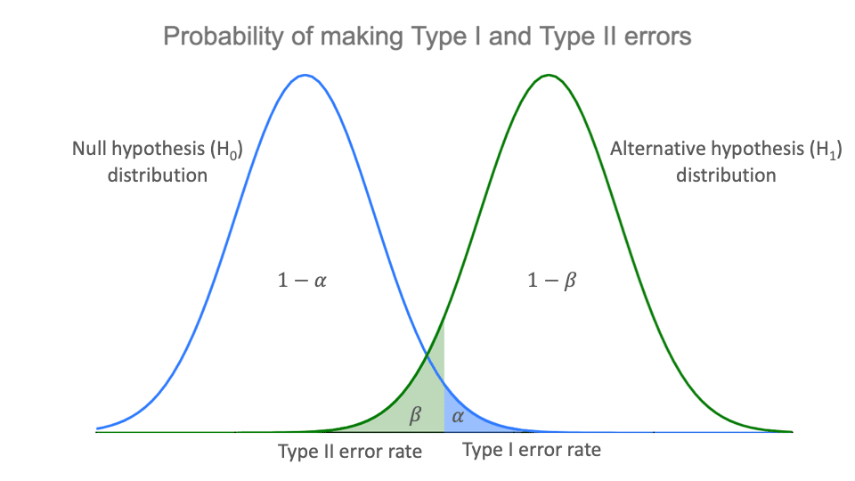

```{r setup, include=FALSE}
knitr::opts_chunk$set(echo = FALSE)
```

```{r echo=FALSE, eval=TRUE,message=FALSE, warning=FALSE}
library(tidyverse)
library(openintro)
library(gridExtra)
library(latex2exp)
data(COL)
seed <- 42
```

## Objectives

:::: {.column width=15%}
::::

:::: {.column width=70%}
- **Introduce hypothesis testing**
- **Know how to difference between null and alternative sampling distributions**
- **Develop an understanding of decision errors**
- **Activity: Determine Claims and Error Types**
::::

:::: {.column width=15%}
::::

## Previously... (1/3)

The guiding principle of statistics is statistical thinking.

```{r statistical-thinking-1, echo=FALSE, fig.cap="Statistical Thinking in the Data Science Life Cycle", fig.align='center', out.width = '55%'}
knitr::include_graphics("statistical-thinking-in-data-science-lifecycle.png")
```

## Previously... (2/3)

**Types of Inference**

|  | **Parameter Estimation** | **Hypothesis Testing** |
|:---|:------|:------|
| _Goal_ | Estimate an unknown population value | Assess claims about a population value |
| _Methods_ | Point Estimation: A single value estimate (e.g., sample mean) <br>Interval Estimation: A range of plausible values (e.g., confidence interval) | State a null and an alternative hypothesis <br>Compute a test statistic and compare it to a threshold (p-value or critical value) |
| _Key Concept_ | Focuses on precision in estimation (confidence intervals) | Focuses on decision-making based on evidence (reject or fail to reject the null hypothesis) |

## Previously... (3/3)

**Confidence Intervals**

$$\text{point estimate} \pm z^{\star} \times \text{SE}.$$

* In a confidence interval, $z^{\star} \times \text{SE}$ is called the **margin of error**, and for a given sample, the margin of error changes as the confidence level changes.
* Using the standard normal distribution, it is possible to find the appropriate $z^{\star}$ for any confidence level.

## Finding $z^{\star}$ Exactly

Find the $z^{\star}$ for a 92\% confidence level.

:::: {.column width=50%}
**Process:**

* Confidence level is 0.92.
* Lower tail of the $Z \sim N(0,1)$ is $\frac{(1-0.92)}{2} = 0.04$.
* We want to find the $z$ score that would yield a 0.04 probability.
* Use the `qnorm()` function in R.

**Using R:**

```{r echo=TRUE}
cl <- 0.92 # confidence level
lt <- (1-cl)/2 # lower tail probability
qnorm(lt,0,1) # computes the z star
```
::::

:::: {.column width=49%}
```{r eval=TRUE, echo=FALSE, message=FALSE, warning=FALSE, fig.align='center',fig.width=7,fig.height=3,out.width='100%'}
# normal pdf
mu <- 0
sigma <- 1
x_norm <- seq(-4,4,0.10)
norm_pdf <- dnorm(x_norm,mu,sigma)

# convert pdf into tibble
df_norm <- tibble(z=x_norm, norm_pdf=norm_pdf)

# plot the Bernoulli distribution and store it into a R variable
p1 <- ggplot(df_norm,aes(x=z,y=norm_pdf)) + 
  geom_line(color="#009159",linewidth=1) + 
  geom_ribbon(data=subset(df_norm,z<=-1.75),aes(x=z,ymax=dnorm(z,mu,sigma)),ymin=0,alpha=0.3,fill="#009159") +
  ylab("density") + 
  ggtitle("0.04 Probability is up to -1.75") + # sets the title of the plot
  scale_x_discrete(limits=c(-1.75)) + 
  theme_minimal() + # set theme of entire plot
  theme(legend.title=element_blank())

# display plot
p1
```

```{r eval=TRUE, echo=FALSE, message=FALSE, warning=FALSE, fig.align='center',fig.width=7,fig.height=3,out.width='100%'}
# normal pdf
mu <- 0
sigma <- 1
x_norm <- seq(-4,4,0.10)
norm_pdf <- dnorm(x_norm,mu,sigma)

# convert pdf into tibble
df_norm <- tibble(z=x_norm, norm_pdf=norm_pdf)

# plot the Bernoulli distribution and store it into a R variable
p1 <- ggplot(df_norm,aes(x=z,y=norm_pdf)) + 
  geom_line(color="#009159",linewidth=1) + 
  geom_ribbon(data=subset(df_norm,z>=-1.75 & z<=1.75),aes(x=z,ymax=dnorm(z,mu,sigma)),ymin=0,alpha=0.3,fill="#009159") +
  ylab("density") + 
  ggtitle("0.92 Probability is Between -1.75 to 1.75") + # sets the title of the plot
  scale_x_discrete(limits=c(-1.75,0,1.75)) + 
  theme_minimal() + # set theme of entire plot
  theme(legend.title=element_blank())

# display plot
p1
```
::::
  
## Introduction to Hypothesis Testing

**Hypothesis testing** is a statistical method used to make inferences about a population based on a sample. It helps determine if an observed effect is statistically significant.

**Key Concepts:**

* *Null Hypothesis ($H_0$):* Assumes no effect or no difference.
* *Alternative Hypothesis ($H_A$):* Represents what we aim to support (effect or difference exists).
* *Significance Level ($\alpha$):* The probability of rejecting $H_0$ when it is true.
* *Test Statistic:* A value calculated from sample data to assess evidence against $H_0$.
* *P-value:* The probability of observing data as extreme as the sample, assuming $H_0$ is true.
* *Conclusion:* Compare p-value with $\alpha$ to decide whether to reject $H_0$ or not.

**Decision Rule:**

* If $p-value \le \alpha$, reject $H_0 \longrightarrow$ Evidence supports $H_A$.
* If $p-value > \alpha$, fail to reject $H_0 \longrightarrow$ Not enough evidence for $H_A$.

**Why is Hypothesis Testing Important?**

* Supports decision-making in research
* Helps determine if results are due to chance or a real effect

## Example 1

**Scenario:**

A pharmaceutical company tests whether a new drug improves recovery rates compared to a placebo.

- **Null Hypothesis (\(H_0\))**: The new drug has no effect (the recovery rate is the same as the placebo).
- **Alternative Hypothesis (\(H_A\))**: The new drug improves recovery rates (higher than the placebo).
- **Significance Level (\(\alpha\))**: 0.05 (5%).

**Test Results:**

- After conducting a clinical trial, the statistical test produces a **p-value of 0.02**.

**Conclusion:**

- Since **p-value (0.02) < significance level (0.05)**, we **reject \(H_0\)**.
- This suggests that there is **strong statistical evidence** that the new drug improves recovery rates compared to the placebo.

## Outcomes of Hypothesis Testing

There are two possible outcomes of the hypothesis test:

  * **Reject** $H_0$: If the **p-value** is less than the **significance level**, then we reject the null hypothesis. Then,  we have enough evidence to support $H_A$.
  
  * **Fail to Reject** $H_0$: If the **p-value** is greater than or equal to the **significance level**, then we fail to reject the null hypothesis. This does not mean the the null hypothesis is true.
  
Making statistical decisions means that you have to deal with uncertainties.

## Decision Errors

```{r decision-errors-meme, out.width = "55%", fig.align='center',fig.cap = "Image Source: [Statistical Performance Measures by Neeraj Kumar Vaid](https://neeraj-kumar-vaid.medium.com/statistical-performance-measures-12bad66694b7){target=_blank}"}

```

This meme might be over used. If you find some memes similar to this but in "non-pregnancy" context, let me know.

## The Significance Level and Decisions Errors

**What does this all mean?** When the p-value is small, i.e., less than a previously set threshold ($\alpha$), we say the results are **statistically significant**.  The value of $\alpha$ represents how rare an event needs to be in order for the null hypothesis to be rejected. The $\alpha$ also represents the probability of committing a type I error.

| Reality/Decision | **Reject $H_0$**                                                      | **Fail to reject $H_0$**                                                  |
|------------------|-------------------------------------------------------------------|-----------------------------------------------------------------------|
| **$H_0$ is true**    | Type I error<br>with probability $\alpha$<br>(significance level) | Correct decision<br>with probability $1-\alpha$<br>(confidence level) |
| **$H_0$ is false**   | Correct decision<br>with probability $1-\beta$<br>(power of test) | Type II error<br>with probability $\beta$                             |

Conclusion errors: Type I error - false positive or Type II error - false negative

## Trade-offs between Type I and Type II errors. (1/2)

<div class='left' style='float:left;width:48%'>
```{r type-1-dist, fig.asp=1, fig.cap = "", fig.align='center'}

```
</div>

<div class='left' style='float:left;width:48%'>
```{r type-2-dist, fig.asp=1, fig.cap = "", fig.align='center'}

```
</div>

<center>
Images Source: [Type I and Type II errors by Pritha Bhandari](https://www.scribbr.com/statistics/type-i-and-type-ii-errors/){target="_blank"}
</center>

## Trade-offs between Type I and Type II errors. (2/2)

```{r type-1-and-2-dist, out.width="70%", fig.align='center',fig.cap = "Images Source: [Type I and Type II errors by Pritha Bhandari](https://www.scribbr.com/statistics/type-i-and-type-ii-errors/){target=_blank}"}

```

## Example 2

  * Question: In a US court, the defendant is either innocent ($H_0$) or guilty ($H_A$). What does a Type I Error represent in this context? What does a Type II Error represent?
  
  >- Answer: If the court makes a **Type I Error**, this means the defendant is innocent ($H_0$ is true) but wrongly convicted. A **Type II Error** means the court failed to reject $H_0$ (i.e., failed to convict the person) when they were in fact guilty ($H_A$ true).
  
## Example 2: Type I error Consequences

**A Type I error occurs when the null hypothesis is incorrectly rejected, leading to a wrongful conviction.**

This means that an innocent person is found guilty and sentenced, possibly facing imprisonment or even capital punishment. The consequences extend beyond the individual, affecting their family, reputation, and future opportunities. Additionally, the real perpetrator remains free, potentially committing further crimes.

## Example 2: Type II error Consequences

**A Type II error occurs when the null hypothesis was failed to reject, leading to a wrongful acquittal.**

This means that a guilty person is found not guilty and released. As a result, justice is not served for the victims, and the criminal may go on to commit additional offenses, putting society at risk. This error can undermine public trust in the legal system, as it fails to hold the guilty accountable.

## Activity: Determine Claims and Error Types

1. Make sure you have a copy of the *M 3/17 Worksheet*. This will be handed out physically and it is also digitally available on Moodle.
2. Work on your worksheet by yourself for 10 minutes. Please read the instructions carefully. Ask questions if anything need clarifications.
3. Get together with another student.
4. Discuss your results.
5. Submit your worksheet on Moodle as a `.pdf` file.

## References

::: {#refs}
:::
