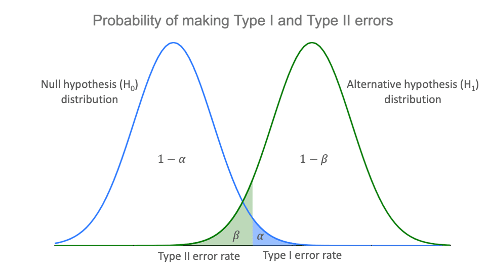

```{r setup, include=FALSE}
knitr::opts_chunk$set(echo = FALSE)
```

```{r echo=FALSE, eval=TRUE,message=FALSE, warning=FALSE}
library(tidyverse)
library(openintro)
library(gridExtra)
library(latex2exp)
library(kableExtra)
data(COL)
seed <- 42
```

## Objectives

:::: {.column width=15%}
::::

:::: {.column width=70%}
- **Develop an understanding of the power of a statistical test**
- **Know how to compute the type II error probability and power**
- **Activity: Determine and Interpret the Power of a Statistical Test**
::::

:::: {.column width=15%}
::::

## Previously... (1/2)

**Types of Decision Errors**

| Reality/Decision | **Reject $H_0$**                                                      | **Fail to reject $H_0$**                                                  |
|------------------|-------------------------------------------------------------------|-----------------------------------------------------------------------|
| **$H_0$ is true**    | Type I error<br>with probability $\alpha$<br>(significance level) | Correct decision<br>with probability $1-\alpha$<br>(confidence level) |
| **$H_0$ is false**   | Correct decision<br>with probability $1-\beta$<br>(power of test) | Type II error<br>with probability $\beta$                             |

## Previously... (2/2)

**Trade-offs between Type I and Type II Errors**

```{r type-1-and-2-dist, out.width="70%", fig.align='center',fig.cap = "Images Source: [Type I and Type II errors by Pritha Bhandari](https://www.scribbr.com/statistics/type-i-and-type-ii-errors/){target=_blank}"}

```

## Type I and Type II Errors

- **Type I error**: Rejecting the null hypothesis when it is true.
- **Type II error**: Failing to reject the null hypothesis when it is false.

## Power of a Test

- **Power** = 1 - $\beta$ where $\beta$ is the probability of a Type II error.
- Power is the probability of correctly rejecting the null hypothesis.
- The type II error probability depends on the parameter values in the alternative hypothesis.

## Example 1: Heart Rate Experiment

Suppose we wish to conduct an experiment to determine if the mean heart rate of healthy adults is 80 beats per minute.

:::: {.column width=49%}
**Hypotheses**

- Null: $H_0: \mu = 80$
- Alternative: $H_a: \mu \neq 80$
- Sample size: $n = 130$
- Significance level: $\alpha = 0.01$
::::

:::: {.column width=50%}
**Assumptions** (For demonstration purposes)

- Normal distribution
- True mean: $78$
- Standard deviation: $6.67$
::::

## Example 1: Simulation to Estimate Type II Error (1/2)

**We simulate the sampling distribution of the true mean, then compare that to the null value.**

```{r echo=TRUE}
samples <- rnorm(130, 78, 6.67) # simulated values
t_stat <- (mean(samples) - 80) / (sd(samples) / sqrt(130))
t_stat # test statistic
qt(.005, 129) # critical value
```

```{r echo=TRUE}
t.test(samples, mu = 80)
```

::: {style="color: red;"}
$\star$ **Key Idea:** The p-value is less than $0.01$. We can reject $H_0$. Here, we want the cases when p-value is greater than $0.01$, where we fail to reject $H_0$.
:::

## Example 1: Simulation for Type II Error (2/2)

**Replicate the same simulation and one-sample t-test and measure the type II error probability**

```{r echo=TRUE}
simdata <- replicate(10000, { # replicate simulation
  dat <- rnorm(130, 78, 6.67) # simulated values
  t.test(dat, mu = 80)$p.value > .01 # determine if p-value is greater than alpha
})
mean(simdata)  # Probability of Type II error
1-mean(simdata) # power probability
```

::: {style="color: red;"}
$\star$ **Key Idea:** The power can be interpreted as the probability of correctly rejecting the null hypothesis when the alternative hypothesis is true.
:::

## Power of Statistical Tests

The power of a statistical test is the probability that the test correctly rejects the null hypothesis ($H_0$) when the alternative hypothesis ($H_A$) is true. In other words, it measures the test’s ability to detect an actual effect when one exists.

Mathematically, power is defined as: $$\text{Power} = 1 - \beta$$ where $\beta$ is the Type II error rate.

How to Interpret Power:

* Higher Power (e.g., 0.8 or 80%):

  - The test is more likely to detect a true effect.
  - There is a lower chance of missing a real difference (Type II error).
  - Commonly, researchers aim for a power of at least 80% in hypothesis testing.

* Lower Power (e.g., 0.5 or 50%):

  - The test has a higher chance of failing to detect a real effect.
  - A study with low power may lead to inconclusive results.
  - This can happen due to small sample sizes, high variability, or a small effect size.

## Factors Affecting Power

* Sample Size ($n$): Larger samples increase power.
* Effect Size ($d$): Larger true differences between groups lead to higher power.
* Significance Level ($\alpha$): A higher $\alpha$ (e.g., 0.10 vs. 0.05) increases power but raises the risk of a Type I error.
* Variability ($\sigma$): Lower variability in data increases power.

## Example 1: Exact Power Calculation

**You can compute the power exactly**

```{r echo=TRUE}
power.t.test(n = 130, delta = 2, sd = 6.67, sig.level = .01, type = "one")
```

## Example 2: Determining Sample Size

How large a sample is needed to detect a clinically significant difference in body temperature from 98.6 degrees with a power of 0.8?

:::: {.column width=49%}
**Hypotheses:**

- $H_0$: Mean body temperature $=$ 98.6°F
- $H_A$: Mean body temperature $\ne$ 98.6°F
- Clinically significant difference: 0.2°F
- Standard deviation estimate: 0.3°F
- Desired power: 0.8
::::

:::: {.column width=50%}
**Power Calculation**

```{r echo=TRUE}
power.t.test(delta = 0.2, sd = .3, sig.level = .01, power = 0.8, type = "one.sample")
```
::::

::: {style="color: red;"}
$\star$ **Key Idea:** The goal of power calculations is to determine the sample size that would achieve a chosen power probability.
:::

## Effect Size and Cohen’s Number

**Effect size** measures the standardized difference between means which is given by Cohen's number: $$d = \frac{\bar{x} - \mu_0}{s}.$$

This number standardizes differences for comparisons.

**Example Calculation:**

$$\text{Group A} \longrightarrow 0.2 = \frac{\bar{x}_A - \mu_A}{1.5} \longrightarrow \bar{x}_A - \mu_A = 0.3$$

```{r echo=TRUE}
power.t.test(n = 30, delta = .3, sd = 1.5, sig.level = .05, type = "one")
```

$$\text{Group A} \longrightarrow 0.2 = \frac{\bar{x}_B - \mu_B}{.5} \longrightarrow \bar{x}_B - \mu_B = 0.1$$

```{r echo=TRUE}
power.t.test(n = 30, delta = .1, sd = .5, sig.level = .05, type = "one")
```

::: {style="color: red;"}
$\star$ **Key Idea:** Both scenarios have the same effect size and power.
:::

## Summary

- Type II errors occur when we fail to reject a false null hypothesis.
- Power measures the ability to detect an effect when one exists.
- Simulations help estimate power when analytical methods are complex.
- The power of a test depends on sample size, effect size, and significance level.
- Effect size (Cohen’s Number \( d \)) standardizes differences for comparisons.

## Activity: Determine and Interpret the Power of a Statistical Test

1. Make sure you have a copy of the *F 3/28 Worksheet*. This will be handed out physically and it is also digitally available on Moodle.
2. Work on your worksheet by yourself for 10 minutes. Please read the instructions carefully. Ask questions if anything need clarifications.
3. Get together with another student.
4. Discuss your results.
5. Submit your worksheet on Moodle as a `.pdf` file.

## References

::: {#refs}
:::
