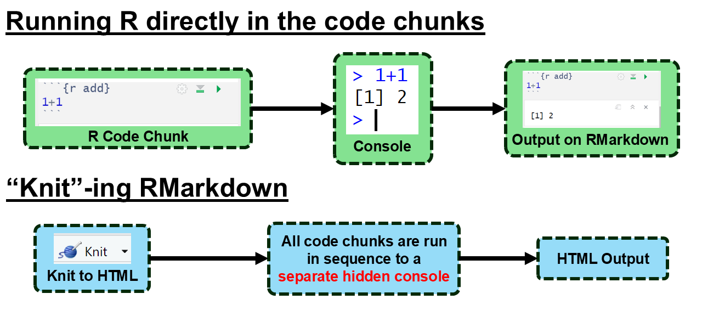
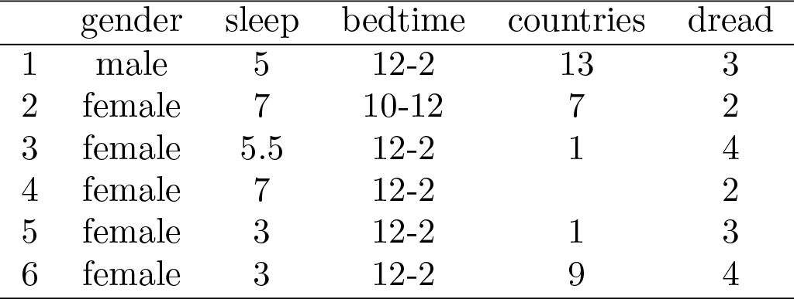
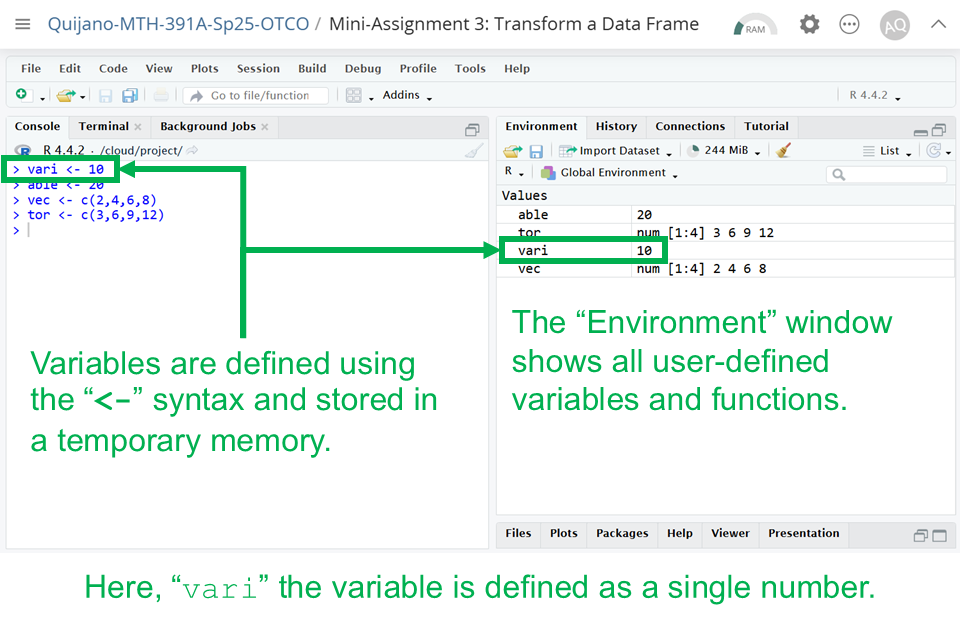
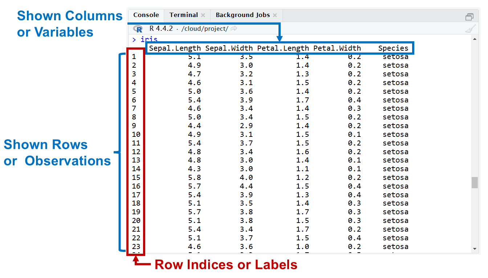
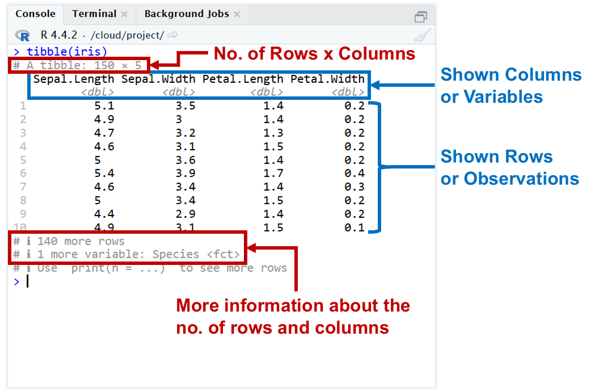
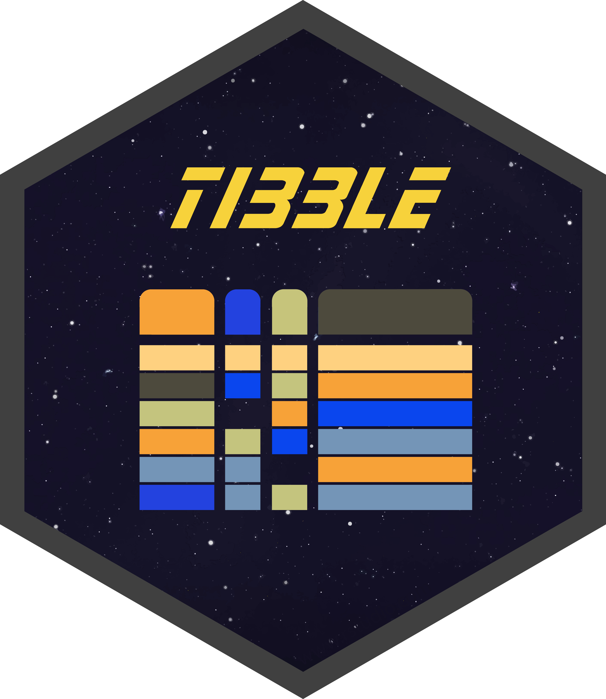
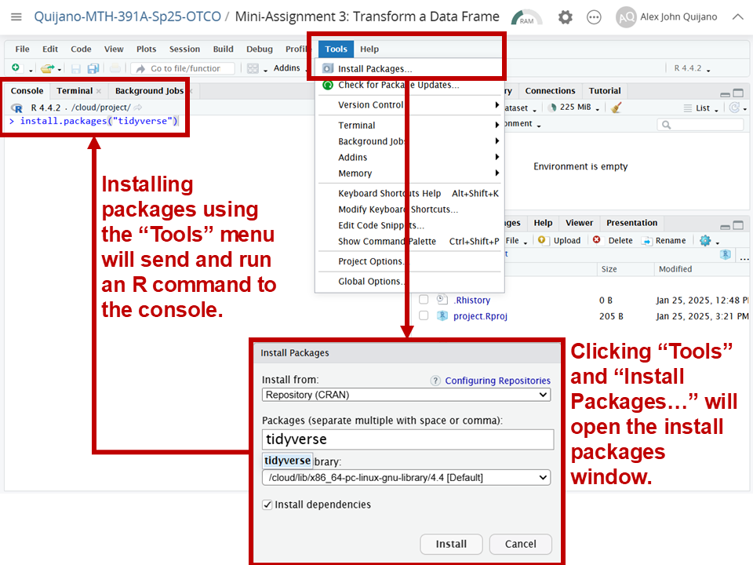

```{r setup, include=FALSE}
knitr::opts_chunk$set(echo = FALSE)
```

## Objectives

:::: {.column width=15%}
::::

:::: {.column width=70%}
- **Develop an understanding on how to identify different types of variables**
- **Know how data is organized into data tables**
- **Introduce R packages, variables, and data frames**
- **Activity: Data Sub-Setting and Identifying Variables**
::::

:::: {.column width=15%}
::::

## Previously... (1/2)

The guiding principle of elementary statistics is statistical thinking.

```{r statistical-thinking-1, echo=FALSE, fig.cap="Statistical Thinking in the Data Science Life Cycle", fig.align='center', out.width = '55%'}
knitr::include_graphics("statistical-thinking-in-data-science-lifecycle.png")
```

## Previously... (2/2)

```{r running-r-code-chunks, echo=FALSE, fig.cap="", fig.align='center', out.width = '75%'}

```

## Types of Variables

```{r types-of-variables, echo=FALSE, fig.cap="Types of Variables [@diez2012openintro]", fig.align='center', out.width = '70%'}
knitr::include_graphics("variables.png")
```

## Case Study 1

A survey was conducted on students in an introductory statistics course. Below are a few of the questions on the survey, and the corresponding variables the data from the responses were stored in:

:::: {.column width=15%}
::::

:::: {.column width=70%}
* **gender:** What is your gender?
* **intro_extra:** Are you an introvert or an extrovert?
* **sleep:** How many hours do you sleep at night, on average?
* **bedtime:** What time do you usually go to bed?
* **countries:** How many countries have you visited?
* **dread:** On a scale of 1-5, how much do you dread being here?
::::

:::: {.column width=15%}
::::

## Data Matrix

Data collected on students in a statistics class on a variety of variables:

```{r data-matrix-with-labels, echo=FALSE, fig.cap="Example Data Matrix [@diez2012openintro]", fig.align='center', out.width = '70%'}
knitr::include_graphics("data-matrix-with-labels.png")
```

## Identify Types of Variables

:::: {.column width=50%}
```{r data-matrix, echo=FALSE, fig.cap="", fig.align='center', out.width = '100%'}

```
::::

:::: {.column width=49%}
* **gender:** nominal categorical
* **sleep:** continuous numerical
* **bedtime:** ordinal categorical
* **countries:**  discrete numerical
* **dread:** ordinal categorical - could also be used as numerical
::::

## Variables

**How are variables created and stored in R?**

```{r variable-defined, echo=FALSE, fig.cap="", fig.align='center', out.width = '50%'}

```

::: {style="color: blue"}
$\dagger$ Create a variable named `ria` and initially define it as a number. Then, redefine `ria` as a vector. What happens to the original value of `ria` (the number) after it is redefined as a vector?
:::

::: {style="color: red"}
$\star$ Knowing and keeping track of what variables are defined is key to understanding why some errors occur.
:::

## Data Frame, An Introduction

:::: {.column width=15%}
::::

:::: {.column width=70%}
**What is a data frame?**

* A data frame is a key data structure in R used for storing data sets.
* It organizes data into rows and columns, similar to a spreadsheet.
* Each column can contain data of a different variable type (e.g., numeric, character, vector).
::::

:::: {.column width=15%}
::::

## Data Frame Key Characteristics

:::: {.column width=49%}
**Base R:** These data frames are data structures that comes with base R.

```{r r-base-df-view, echo=FALSE, fig.cap="", fig.align='center', out.width = '90%'}

```
::::

:::: {.column width=49%}
**Tibbles:** Tibbles are special kinds of data frames using the `tibble` package.

```{r tibble-df-view, echo=FALSE, fig.cap="", fig.align='center', out.width = '90%'}

```
::::

::: {style="color: red"}
$\star$ A base R data frame can be converted to a tibble data frame using the `tibble()` function. The `iris` data set is a built-in data in the `datasets` packages, which comes with base R.
:::

## R Packages

:::: {.column width=15%}
::::

:::: {.column width=70%}
**What are R packages?**

* Packages in R are collections of functions, data, and documentation that extend the capabilities of base R.
* It includes manuals and examples to help users understand how to use the package.
::::

:::: {.column width=15%}
::::

## Base R versus R Packages {.smaller}

| **Aspect** | **Base R** | **R Packages** |
|:---|:------|:------|
| *Availability* | Comes pre-installed with R | Must be installed and loaded |
| *Functionality* | Offers basic statistical and programming tools | Provides advanced or specialized tools not included in base R |
| *Customization* | Limited to what's already available | Highly customizable; users can install or even create their own packages |
| *Performance* | Base R can sometimes be slower or more verbose | Packages often include optimized or simpler syntax for complex tasks |
| *Speciality* | Limited only for basic statistics | Often built for a specific purpose or knowledge |

## The `tidyverse` Package

:::: {.column width=40%}
`tidyverse` is a collection of packages suited for data processing and visualization.

```{r tidyverse-hex, echo=FALSE, fig.cap="", fig.align='center', out.width = '60%'}
knitr::include_graphics("tidyverse.png")
```
::::

:::: {.column width=59%}
Core packages specifically for data processing:

:::: {.column width=20%}
```{r dplyr-hex, echo=FALSE, fig.cap="", fig.align='left', out.width = '100%'}

```

```{r tidyr-hex, echo=FALSE, fig.cap="", fig.align='left', out.width = '100%'}
knitr::include_graphics("tidyr.png")
```

```{r tibble-hex, echo=FALSE, fig.cap="", fig.align='left', out.width = '100%'}

```
::::

:::: {.column width=78%}
* `dplyr` provides a grammar for data transformation.
* `tidyr` provides a set of functions that help you get data in consistent form.
* `tibble` is a data frame that prioritize simplicity, enforcing stricter checks to promote cleaner, more expressive code.
::::

::::

## Installing Packages

**How to install R Packages?**

The following two methods installs the `tidyverse` package.

:::: {.column width=49%}
* **Using the "Tools" menu**

```{r tools-install, echo=FALSE, fig.cap="", fig.align='center', out.width = '80%'}

```
::::

:::: {.column width=50%}
* **Using the R Console Directly**

```{r tidyverse-install, message=FALSE, warning=FALSE, eval=FALSE, echo=TRUE}
install.packages("tidyverse")
```

::: {style="color: blue"}
$\dagger$ Try the above code sequence in your console. Then, install a different package called `plotly`.
:::

::: {style="color: red"}
$\star$ Knitting an RMarkdown with this function in a code chunk will give you an error. You need to run it directly on the console.
:::
::::

## Loading Packages

**How to load R Packages?**

The function `library()` loads any installed package. In this case `library("tidyverse")` loads the `tidyverse` package specifically.

```{r warning=FALSE, echo=TRUE}
library("tidyverse")
```

::: {style="color: blue"}
$\dagger$ Try the above code sequence in your console. Then, load the package `plotly`.
:::

## In-Class Demonstration

**Case Example:** Using the `iris` data set, convert the data frame into a tibble and save it as a new R variable. We want to subset all rows with the "versicolor" species and save them in its individual tibble.

:::: {.column width=49%}
**The original data frame is shown below.**

```{r}
glimpse(iris)
```
::::

:::: {.column width=49%}
**The end result is the following data frames.**

```{r}
iris_tibble <- tibble(iris)
versicolor_tibble <- tibble(iris_tibble[iris_tibble$Species == "versicolor",])
glimpse(versicolor_tibble)
```
::::

::: {style="color: blue"}
$\dagger$ The task here is to replicate the shown data frames using R data frame subsetting.
:::

## Activity: Data Sub-Setting and Identifying Variables

The purpose of this activity is for you to start developing a proficiency in identifying statistical variables given a dataframe, using R packages, and subsetting data frames.

1. Log-in to Posit Cloud and open the R Studio assignment *M 1/27 - Data Sub-Setting and Identifying Variables*.

2. Make sure you are in the current working directory. Rename the `.Rmd` file by replacing `[name]` with your name using the format `[First name][Last initial]`. Then, open the `.Rmd` file.

3. Change the author in the YAML header.

4. Read the provided instructions.

5. Answer all exercise problems on the designated sections.

## References

::: {#refs}
:::
