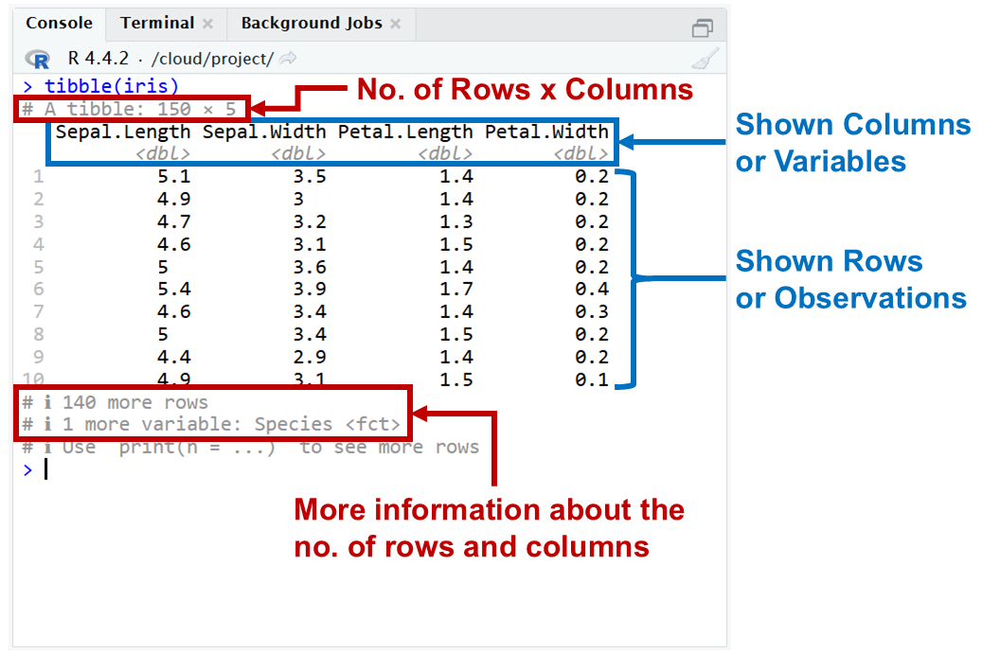
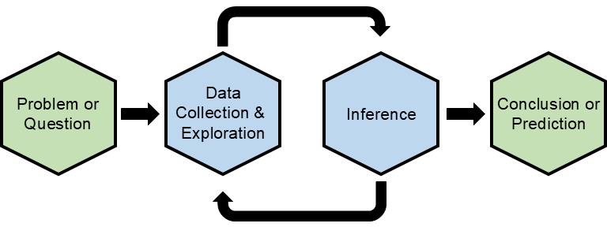

```{r setup, include=FALSE}
knitr::opts_chunk$set(echo = FALSE)
```

## Objectives

:::: {.column width=15%}
::::

:::: {.column width=70%}
- **Develop an understanding of visualizing data**
- **Know the basics of wrangling a data frame**
- **Introduce the language of the `tidyverse` package**
- **Activity: Visualize Data by Variable Type**
::::

:::: {.column width=15%}
::::

## Previously... (1/3)

```{r types-of-variables, echo=FALSE, fig.cap="Types of Variables", fig.align='center', out.width = '70%'}
knitr::include_graphics("variables.png")
```

## Previously... (2/3)

:::: {.column width=49%}
**R Packages:** `tidyverse` is a collection of packages suited for data processing and visualization.

```{r echo=TRUE, message=FALSE, warning=FALSE}
library(tidyverse)
```

```{r tidyverse-hex, echo=FALSE, fig.cap="", fig.align='center', out.width = '60%'}
knitr::include_graphics("tidyverse.png")
```
::::

:::: {.column width=49%}
**Tibbles:** Tibbles are special kinds of data frames using the `tibble` package in `tidyverse`.

```{r tibble-df-view, echo=FALSE, fig.cap="", fig.align='center', out.width = '90%'}

```
::::

## Previously... (3/3)

The guiding principle of elementary statistics is statistical thinking.

```{r statistical-thinking-1, echo=FALSE, fig.cap="Statistical Thinking in the Data Science Life Cycle", fig.align='center', out.width = '55%'}

```

## Data Frame Processing Using `dplyr`

:::: {.column width=49%}
**What is `dplyr`?**

* **Overview:**
    - `dplyr` is a powerful R package designed for data processing.
    - It is part of the `tidyverse` ecosystem.
    
* **Key Features:**
    - Simplifies common data wrangling tasks.
    - Intuitive syntax with chaining using the pipe operator `%>%`.
::::

:::: {.column width=49%}
**Why use `dplyr`?**

* **Ease of Use:** Clear, human-readable code.
* **Efficiency:** Built-in functions optimized for performance.
* **Consistency:** Works seamlessly with other `tidyverse` packages such as `ggplot2` for visualizations.
* **Data Frames and Beyond:** Works with data frames, tibbles, and databases.
::::

## Core Verbs for Rows of `dplyr` {.smaller}

**`dplyr` functions that operates on rows.**

| **Verb** | **Purpose** | **Example** |
|:---|:------|:------|
| `filter()` | Chooses rows based on conditions | `filter(data, col1 > 10)` |
| `arrange()` | Reorders rows | `arrange(data, col1)` |
| `distinct()` | Finds all the unique rows | `distinct(data, col1)` |
| `count()` | Finds all unique rows, then counts the number of occurrences | `count(data, col1)` |

::: {style="color: red"}
$\star$ Notice that the data frame `data` in the examples are always in the first argument in the verbs. *The `filter()` verb uses logical operators, which we will discuss later in detail.*
:::

## Core Verbs for Rows of `dplyr`: Example {.smaller}

### Define Data Frame as a Tibble

```{r echo=TRUE, eval=TRUE}
iris_tibble <- tibble(iris)
```

### Filtering by subsetting

::: {style="color: red"}
$\star$ Here, you have to call the tibble twice to filter it, and it returns as a vector.
:::

```{r echo=TRUE, eval=FALSE}
iris_tibble[iris_tibble$Species == "versicolor",]
```

### Filtering by the `filter()` function

::: {style="color: red"}
$\star$ Here, you just have to call the tibble once to filter it, and it returns a tibble.
:::

```{r echo=TRUE, eval=FALSE}
filter(iris_tibble, Species == "versicolor")
```

## Core Verbs for Columns of `dplyr` {.smaller}

**`dplyr` functions that operates on columns.**

| **Verb** | **Purpose** | **Example** |
|:---|:------|:------|
| `mutate()` | Adds or modifies columns | `mutate(data, new_col = col1-col2)` |
| `select()` | Chooses specific columns | `select(data, col1, col2)` |
| `rename()` | Renames specific columns | `rename(data, 1loc = col1)` |
| `relocate()` | Moves columns to the front | `relocate(data, col1)` |

::: {style="color: red"}
$\star$ The `=` signs in column verbs are not logical operators. Only the `filter()` verb uses the logical operators.
:::

## Core Verbs for Columns of `dplyr`: Example {.smaller}

### Define Data Frame as a Tibble

```{r echo=TRUE, eval=TRUE}
iris_tibble <- tibble(iris)
```

### Adding Columns by subsetting

::: {style="color: red"}
$\star$ Here, you have to call the tibble multiple times to add a column.
:::

```{r echo=TRUE, eval=FALSE}
# this adds a new column named length_ratio
# length_ratio = Petal.Length/Sepal.Length
iris_tibble$length_ratio <- iris_tibble$Petal.Length/iris_tibble$Sepal.Length
```

### Adding Columns by the `mutate()` function

::: {style="color: red"}
$\star$ Here, your just need to call the tibble once to add a column,a nd just update the original tibble.
:::

```{r echo=TRUE, eval=FALSE}
# this adds a new column named length_ratio and updates the tibble
# length_ratio = Petal.Length/Sepal.Length
iris_tibble <- mutate(iris_tibble,length_ratio = Petal.Length/Sepal.Length)
```

## `dplyr` Verbs for Tidying Data {.smaller}

**`dplyr` functions that operates on rows and columns.**

| **Verb** | **Purpose** | **Example** |
|:---|:------|:------|
| `group_by()` | Groups rows by one or more variables, allowing operations to be performed within groups. | `group_by(data,category)` |
| `summarise()` | Reduces multiple rows into a single summary row per group. | `summarise(data,mean_variable = mean(variable))` |

::: {style="color: red"}
$\star$ The `group_by()` and `summarise()` usually goes together if you need to compute descriptive statistics of each category of a categorical variable.
:::

## `dplyr` Verbs for Tidying Data: Example {.smaller}

### Define Data Frame as a Tibble

```{r echo=TRUE, eval=TRUE}
iris_tibble <- tibble(iris)
```

### Computing the Mean Sepal Length of Each Species

::: {style="color: red"}
$\star$ Here, you are nesting the functions `group_by()` and `summarise()` to compute the means of each species.
:::

```{r echo=TRUE, eval=TRUE}
summarise(group_by(iris_tibble,Species),mean_sepal_length = mean(Sepal.Length))
```

## Chaining `dplyr` Verbs Using `%>%` (1/3)

:::: {.column width=15%}
::::

:::: {.column width=70%}
**What is `%>%`?**

  * The pipe operator. 
  * It is used to chain multiple verbs in a logical sequence.
  * It starts with a data frame and ends with a transformed data frame.
  * Our textbook uses the syntax `%>%`, but the use of `|>` is becoming common recently.
::::

:::: {.column width=15%}
::::

## Chaining `dplyr` Verbs Using `|>` (2/3)

**Simple Example.** The following code sequence filters the `iris` data frame (in tibble form) to include only the "versicolor" species.

```{r echo=TRUE, eval=FALSE}
iris_tibble %>% 
  filter(Species == "versicolor")
```

::: {style="color: red"}
$\star$ Notice that the first line is the data frame itself, then the next line is the verb without putting it directly into the first argument of the `filter()` verb. This is a common practice of organizing verbs in a pipeline.
:::

## Chaining `dplyr` Verbs Using `|>` (3/3)

**Advanced Example:** The goal of this example is to transform the `iris` data set where we want to compute the ratio of the variables `Petal.Length` and `Sepal.Length` of the "versicolor" species.

```{r echo=TRUE, eval=FALSE}
iris_tibble %>% 
  # rule 1: choose only the "setosa" species
  filter(Species == "versicolor") |> 
  # rule 2: pick the variables sepal length and petal length
  select(Sepal.Length,Petal.Length) |> 
  # rule 3: create a new variable called length_ratio
  mutate(length_ratio = Petal.Length/Sepal.Length)
```

::: {style="color: blue"}
$\dagger$ Try the above code sequence in your console and try mixing the order of the verbs. Do you still have the same results using the original order of rules? If not, why?
:::

::: {style="color: red"}
$\star$  The verbs don't explicitly include the resulting data frames as the first argument because the pipe operator assumes it as the input for each verb in the sequence.
:::

## Chaining with `group_by()` and `summarise()`

### Summarising by Nesting Verbs

::: {style="color: red"}
$\star$ Here, you are nesting the functions `group_by()` and `summarise()` to compute the means of each species.
:::

```{r echo=TRUE, eval=FALSE}
summarise(group_by(iris_tibble,Species),mean_sepal_length = mean(Sepal.Length))
```

### Summarising by Piping Verbs

::: {style="color: red"}
$\star$ Here, you are using the piping operator `%>%`, where you don't need to nest the verbs, and the verbs are written in a logical sequence line-by-line.
:::

```{r echo=TRUE, eval=FALSE}
iris_tibble %>% 
  # Step 1: group by species
  group_by(Species) %>% 
  # step 2: Calculate the mean of the sepal length variable
  summarise(mean_sepal_length = mean(Sepal.Length))
```

::: {style="color: blue"}
$\dagger$ 
:::

## Activity: Summarise Data by Category

The purpose of this activity is for you to start developing a proficiency in identifying statistical variables given a dataframe, using R packages, and subsetting data frames.

1. Log-in to Posit Cloud and open the R Studio assignment *W 1/29 - Summarise Data by Category*.

2. Make sure you are in the current working directory. Rename the `.Rmd` file by replacing `[name]` with your name using the format `[First name][Last initial]`. Then, open the `.Rmd` file.

3. Change the author in the YAML header.

4. Read the provided instructions.

5. Answer all exercise problems on the designated sections.

## References

::: {#refs}
:::
