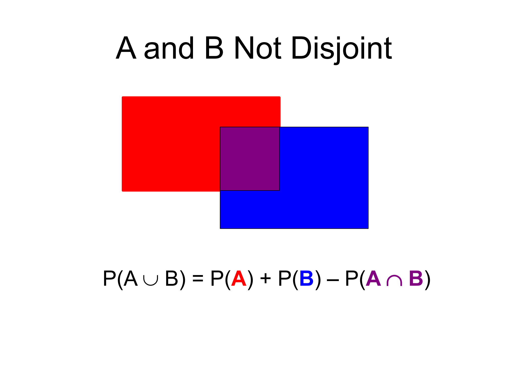
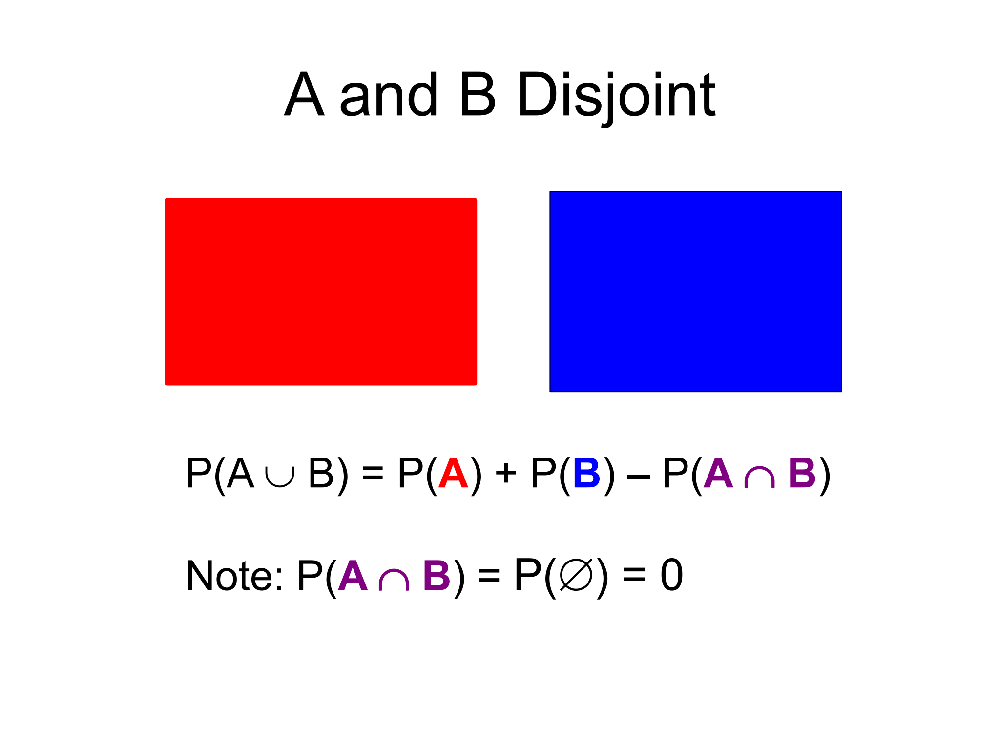

```{r setup, include=FALSE}
knitr::opts_chunk$set(echo = FALSE)
```

## Objectives

:::: {.column width=15%}
::::

:::: {.column width=70%}
- **Develop an understanding of the sample space, events, and random variables**
- **Introduce the axioms of probability**
- **Know how to compute basic probabilities using probability rules**
- **Activity: Computing Probabilities**
::::

:::: {.column width=15%}
::::

## Probability and Statistics

:::: {.column width=49%}
**Probability**
```{r dice-clip-art, echo=FALSE, fig.cap="", out.width="300px", fig.align="center"}

```

  * A measure on how likely an event occurs
  * Computing probabilities have rules
  * Logical reasoning
  * One answer
::::

:::: {.column width=50%}
**Statistics**

```{r fig-histogram-x, out.width = "70%", fig.align='center'}
library(MASS)
set.seed(0); x <- rnorm(1000)
fit <- fitdistr(x, "normal")
para <- fit$estimate
font.scale <- 2.5
par(mar=c(5,6,4,1)+.1)
hist(x, breaks=50, prob = TRUE, cex.lab=font.scale, cex.axis=font.scale, cex.main=font.scale, cex.sub=font.scale)
curve(dnorm(x, para[1], para[2]), col = 2, add = TRUE, lwd=4)
dev.new()
```

  * Methods on answering how likely it is that a claim is true
  * It's an art and science
  * Data-driven approach to write conclusions
  * Multiple ways to solve problems
::::

## What is probability?

**Probability** is the branch of mathematics that deals with randomness. The **likelihood** of an event happening.

An extent to which an event is likely to occur is $$\text{probability} = \frac{\text{an event}}{\text{all possible events}}.$$

## Sample Space, and Events

:::: {.column width=49%}
* The **sample space** is the set of all possible outcomes.

*Coin Example:* $\Omega = \{H,T\}$

* An **event** is any subset of the sample space. An **event space** contains all subsets of outcomes of the sample space.

*Coin example:* <br>
        $\{H\}$, $\{T\}$, $\{H,T\}$, $\emptyset$
::::

:::: {.column width=50%}
* A **disjoint event** is an event where the intersection of two sets are empty.

*Coin Example:* <br>
        $\{H\}$ and $\{T\}$ are disjoint. <br>
        $\{H,T\}$ and $\{T\}$ are NOT disjoint.
::::
    
## Set Notation

Suppose we have **events** A and B:

* **$\cap$ means “intersection”**

"$A \cap B$" is the set of all objects in A **AND** B
  
* **$\cup$ means "union"**

"$A \cup B$" is the set of all objects in A **OR** B.
  
* Disjoint events:

$A$ and $B$ are **disjoint** if $A \cap B = \emptyset$

## Joint and Disjoint Events

:::: {.column width=49%}
```{r joint, echo=FALSE, fig.cap="", out.width="100%", fig.align="center"}

```
::::

:::: {.column width=50%}
```{r disjoint, echo=FALSE, fig.cap="", out.width="100%", fig.align="center"}

```
::::

## Fair Coin

**What is a fair coin?** "Fair" means equal chance of getting a head ($H$) or tail ($T$).

* For the fair coin, we have <br>
    $P(H) = \frac{1}{2} \longrightarrow$ the probability of heads is one half. <br>
    $P(T) = \frac{1}{2} \longrightarrow$ the probability of tails is one half.
    
* The symbol $P$ is known to be the **probability function** which maps the events in a sample space to a value between $0$ and $1$.
    
* Applying the set notation: <br>
    $P(H \cup T) = 1$ because $\{H,T\}$ is the union of events $\{H\}$ and $\{T\}$. <br>
    Specifically, we have $P(H \cup T) = P(H) + P(T) = \frac{1}{2} + \frac{1}{2} = 1$. <br>
    $P(H \cap T) = 0$ because $\{H\}$ and $\{T\}$ are disjoint. <br>
    $P(\emptyset) = 0$ because there are only two possible outcomes $H$ and $T$.

## Random Variables

A **random variable** is a numerical outcome of a random experiment. It assigns a number to each possible outcome in a sample space.

In other words, a random variable is **a function that maps the sample space into real numbers**.

**Types**

* *Discrete Random Variable:* Takes on a countable number of values.
* *Continuous Random Variable:* Takes on any value in an interval.

*Coin Example:* <br>
    A discrete random variable with sample space $\Omega = \{H,T\}$ maps to $X = \{H=1,T=0\}$. <br>
    In this case, we can write $P(X = 1) = \frac{1}{2}$ and $P(X = 0) = \frac{1}{2}$.
    
## Probability Axioms

Probability functions must satisfy the following basic rules:

* The sum of the probabilities for all outcomes in the sample space is equal to 1: $$P(\Omega) = 1.$$
  
* The empty set has $0$ probability: $$P(\emptyset) = 0.$$
  
* Probabilities are always positive (never negative) and always between $0$ and $1$: $$P \in [0,1].$$
  
* If events A and B are disjoint (mutually exclusive - $A \cap B = \emptyset$), the $$P(A \cup B) = P(A) + P(B).$$

## Fair Coin Flips

We know that for a fair coin, $P(H) = \frac{1}{2}$ and $P(T) = \frac{1}{2}$.

Now, let's do an experiment...

* Let's say we **flip a fair coin three times**.
  
    - Question: How many **possible outcomes** are there?
    - Answer: Since there are 2 outcomes per flip, then the number of possible outcomes is $$2 \times 2 \times 2 = 8.$$
  
* The **sample space** for **three coin flips** is written as
  $$
  \begin{matrix}
  \{\{H,H,H\},\{H,H,T\},\{H,T,T\},\{T,T,T\}, \\
  \{T,T,H\},\{T,H,H\},\{H,T,H\},\{T,H,T\}\}
  \end{matrix}
  $$

## Inpependence

What is the probability for the fair coin? We need to determine the **probability** for each **outcome**.
  
* For a fair coin, $P(H) = \frac{1}{2}$ and $P(T) = \frac{1}{2}$ which does not change for each flip. We call this **independent** events.
* Consequently, for independent events $A$ and $B$, $P(A \cap B) = P(A)P(B)$.
  - Question: What is the probability of getting $\{H,H,H\}$.
  - Answer: $P(\{H,H,H\}) = P(H)P(H)P(H) = \frac{1}{2} \frac{1}{2} \frac{1}{2} = \frac{1}{8}$
* In fact, the probability of getting any outcome from the sample space is $\frac{1}{8}$.

## Coin Flipping and Random Variables (1/2)

Recall that the sample space for three coin flips is 
  $$
  \begin{matrix}
  \{\{H,H,H\},\{H,H,T\},\{H,T,T\},\{T,T,T\}, \\
  \{T,T,H\},\{T,H,H\},\{H,T,H\},\{T,H,T\}\}
  \end{matrix}
  $$

* Question: If we flip the coin three times, what is the probability of getting **exactly** two heads in any order?
  - Answer: $P(\{\{H,H,T\},\{T,H,H\},\{H,T,H\}\}) = \frac{3}{8}$

* Question: If we flip the coin three times, what is the probability of getting **at least** two heads in any order?
  - Answer: $P(\{\{H,H,H\},\{H,H,T\},\{T,H,H\},\{H,T,H\}\}) = \frac{4}{8} = \frac{1}{2}$
 
* Question: If we flip the coin three times, what is the probability of getting **at most** two heads in any order?
  - Answer: $P(\{T,T,T\},\{\{H,T,T\},\{T,T,H\},\{T,H,T\},\{H,H,T\},\{T,H,H\},\{H,T,H\}\}) = \frac{7}{8}$
  
## Coin Flipping and Random Variables (2/2)

Let $X$ be a random variable that **counts the number of $H$** in the sample space for three coin flips.

$$X = \{0,1,2,3\}$$

The random variable $X$ is now a set of discrete numbers that counts the number of $H$.

:::: {.column width=15%}
::::

:::: {.column width=70%}
**Probabilities:**

* $P(X = 0) = \frac{1}{8}$
* $P(X = 1) = \frac{3}{8}$
* $P(X = 2) = \frac{3}{8}$
* $P(X = 3) = \frac{1}{8}$
::::

:::: {.column width=15%}
::::

::: {style="color: red;"}
$\star$ The above is an example of a probability distribution.
:::

## Activity: Computing Probabilities

1. Make sure you have a copy of the *W 2/5 Worksheet*. This will be handed out physically and it is also digitally available on Moodle.
2. Work on your worksheet by yourself for 10 minutes. Please read the instructions carefully. Ask questions if anything need clarifications.
3. Get together with another student.
4. Discuss your results.
5. Submit your worksheet on Moodle as a `.pdf` file.

## References

::: {#refs}
:::
