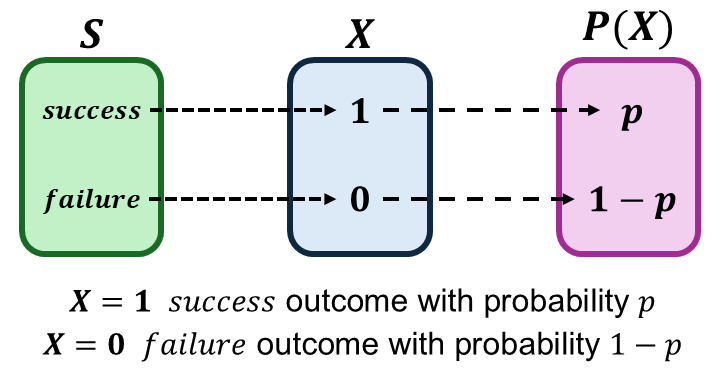

```{r setup, include=FALSE}
knitr::opts_chunk$set(echo = FALSE)
```

```{r echo=FALSE, eval=TRUE,message=FALSE, warning=FALSE}
library(tidyverse)
library(openintro)
data(COL)
seed <- 42
```

## Objectives

:::: {.column width=15%}
::::
 
:::: {.column width=70%}
- **Introduce the expected value and variance**
- **Know how to compute the expected value of a random variable**
- **Develop an understanding of variance in terms of the expected value**
- **Activity: Proving the Variance Formula**
::::

:::: {.column width=15%}
::::

## Previously... (1/3)

**Basic Probability Rules**

| **Rule** | **Formula** |
|:---|:------|
| *Independence* | $P(A \cap B) = P(A)P(B)$ |
| *Joint (Union)* | $P(A \cup B) = P(A) + P(B) - P(A \cap B)$ |
| *Disjoint* | $P(A \cap B) = 0$ |
| *Complement* | If $P(A) + P(B) = 1$, then $1-P(A)=P(B)$. |

## Previously... (2/3)

**Probability Axioms**

| **Axiom** | **Statement** |
|:---|:------|
| $P(S) = 1$ | The sum of the probabilities for all outcomes in the sample space is equal to 1. |
| $P \in [0,1]$ | Probabilities are always positive and always between $0$ and $1$. |
| $P(A \cup B) = P(A) + P(B)$ | If events A and B are disjoint (mutually exclusive), then their probabilities can be added. |

## Previously... (3/3)

**Random Variables**

A random variable (r.v) is a function that maps the sample space into real numbers.

**Probability Functions**

A probability function maps the r.v. into the the real numbers between 0 and 1.

There are two types of r.v.s --discrete and continuous-- with corresponding probability functions --probability mass function (PMF) and probability density function (PDF) respectively.

## R.V. of Binary Outcomes

Suppose we conduct an experiment of one randomized outcome from a binary r.v..

A **binary r.v.** $X$ is a variable that takes only two possible values, typically labelled as "success" and "failure".

:::: {.column width=49%}
* Let $S = \{\text{success},\text{failure}\}$ be the sample space.
* The r.v. is given by
\[
\begin{aligned}
X(\text{success}) & = 1 \\
X(\text{failure}) & = 0 \\
\end{aligned}
\]
::::

:::: {.column width=50%}
```{r binary-rv, echo=FALSE, fig.cap="", out.width="95%", fig.align="center"}

```
::::

::: {style="color: red;"}
$\star$ **Key Idea:** A r.v. with binary outcome is called the **Bernoulli R.V.** with a probability of "success" $p$ and "failure" $1-p$, where $p$ is called the *parameter*.
:::

## The Bernoulli R.V.

A **Bernoulli r.v.** represents a single experiment with two possible outcomes: "success" ($X=1$) with probability $p$ and failure ($X=0$) with probability $1-p$. We typically define an r.v. using $\sim$ along with the name and its parameter: $$X \sim \text{Bern}(p)$$

The **Bernoulli distribution** is a **probability mass function** that computes the probability of the Bernoulli r.v..

$$
P(X = x) = 
\begin{cases}
p & \text{, if } x = 1 \\
1-p & \text{, if } x = 0
\end{cases}.
$$

where $p$ is the parameter (also the probability of "success").

The above function can also be written as

$$P(X = x) = p^x (1-p)^{1-x}, \ \ x \in \{0,1\}.$$

## The Bernoulli R.V.: Flipping a Fair Coin

Suppose we conduct an experiment of flipping a fair coin once.

This scenario can be modeled using the Bernoulli R.V. with parameter $p=0.50$ because the probability of "success" is $0.50$.

Here, we define a "success" of the r.v. to be the $H$ outcome: $$X \sim \text{Bern}(0.50)$$ with PMF defined as $$P(X=x) = (0.50)^x (1-0.5)^{1-x}, \ \ x \in \{0,1\}.$$

::: {style="color: red;"}
$\star$ **Key Idea:** Any scenario for one experiment with binary outcomes can be modeled using the Bernoulli r.v..
:::

## The Expected Value for the Discrete R.V.

The **expected value** of a r.v. is the weighted mean (average) of all possible values that the variable can take, weighted by their probabilities. It represents the long-run average outcome of a random experiment.

**Discrete R.V.**

For a discrete r.v. $X$, the **expected value (or expectation)** is given by $$\text{E}(X) = \sum_{i=1}^{n} x_i P(X = x_i)$$ where:

* $x_1, x_2, \dots, x_n$ are the $n$ possible values of $X$
* $P(X = x_i)$ represents the probability mass function (PMF) of $X$ evaluated at $x_i$.

::: {style="color: red;"}
$\star$ **Key Idea:** This formula provides a weighted average (or the "center of mass") of the possible values of the discrete r.v. $X$, with each value weighted by its probability.
:::

## The Expected Value of the Bernoulli R.V.

\[
\begin{aligned}
\text{R.V. } & \longrightarrow X \sim \text{Bern}(p) \\
\text{PMF } & \longrightarrow P(X = x) = p^x (1-p)^{1-x}, \ \ x \in \{0,1\}
\end{aligned}
\]

The expected value of $X$ is given by
$$
\begin{aligned}
\text{E}(X) & = 1 \cdot p^{1} (1-p)^{1-1} + 0 \cdot p^{0} (1-p)^{1-0} \\
     & = 1 \cdot p + 0 \cdot (1-p) \\
\text{E}(X) & = p
\end{aligned}
$$

::: {style="color: red;"}
$\star$ **Key Idea:** The expected value of a Bernoulli random variable is simply its success probability $p$.
:::

## Properties of the Expected Value

Let $X$ be a discrete or continuous r.v.. The following properties are true and it can be shown using the definition of the expected value.

| **Property** | **Formula** |
|:---|:------|
| _Constant_ | $\displaystyle \text{E}(c) = c$ or $\text{E}(cX) = c\text{E}(X)$ |
| _Linearity_ | $\displaystyle \text{E}(aX + bY) = a\text{E}(X) + b\text{E}(Y)$ |
| _Sum_ | $\displaystyle \text{E}\left(\sum_i^{n} X_i \right) = \sum_i^{n} E\left( X_i \right)$ |
| _Expectation_ | $\displaystyle \text{E}(\text{E}(X)) = \text{E}(X)$

::: {style="color: red;"}
$\star$ **Key Idea:** The expected value of a r.v. is always constant but the interpretation depends on context --*we will discuss more on this later*.
:::

## Raw Moments for the Discrete R.V.

The **$k$-th raw moment** of a discrete random variable $X$ is given by $$\text{E}\left(X^k \right) = \sum_{i=1}^{n} x_i^k P(X = x_i)$$ where: $P(X = x_i)$ is the PMF of $X$ for $i=1,2,\cdots,n$.

* The first raw moment ($k=1$) is the expected value $\text{E}(X)$.
* Higher-order raw moments describe properties such as the variance.

**Why is called "Raw Moments"?** They give us raw, unadjusted information about the probability distribution’s characteristics.

## The Variance for the Discrete R.V.

The **variance** of a r.v. $X$ measures the spread of $X$ around its expected value.

**Discrete or Continuous R.V.**

For a r.v. $X$, the **variance** is given by $$\text{Var}(X) = \text{E}\left( X - \text{E}(X) \right)^2$$ where:

* $\text{E}(X)$ is the expected value of $X$ (or the 1st raw moment)

Using the properties of the expected value, the variance formula reduces to $$\text{Var}(X) = \text{E}\left(X^2 \right) - \left( \text{E}(X) \right)^2$$ where:

* $\text{E}\left(X^2 \right)$ is the 2nd raw moment.

::: {style="color: red;"}
$\star$ **Key Idea:** This formula shows how maximizing variance increases the spread of a random variable's values, reflecting greater *uncertainty*. In other words, the *worst case scenario* of uncertainty.
:::

## The Variance of the Bernoulli R.V.

\[
\begin{aligned}
\text{R.V. } & \longrightarrow X \sim \text{Bern}(p) \\
\text{PMF } & \longrightarrow P(X = x) = p^x (1-p)^{1-x}, \ \ x \in \{0,1\}
\end{aligned}
\]

The 2nd raw moment of $X$ is given by
$$
\begin{aligned}
\text{E}\left( X^2 \right) & = 1^2 \cdot p^{1} (1-p)^{1-1} + 0^2 \cdot p^{0} (1-p)^{1-0} \\
     & = 1 \cdot p + 0 \cdot (1-p) \\
     & = p
\end{aligned}.
$$

Since $\text{E}(X) = p$ and $\text{E}\left(X^2\right) = p$, then the variance of $X$ is given by
$$
\begin{aligned}
\text{Var}(X) & = \text{E}\left(X^2 \right) - \left( \text{E}(X) \right)^2 \\
              & = p - p^2 \\ 
\text{Var}(X) & = p(1-p)
\end{aligned}
$$

::: {style="color: red;"}
$\star$ **Key Idea:** The variance of a Bernoulli random variable is simply the product of the "success" and "failure" probabilities.
:::

## Making Sense of the Variance of the Bernoulli R.V.

The variance of the Bernoulli r.v. is $\text{Var}(X) = p(1-p)$ where $p$ is "success" probability.

```{r message=FALSE, warning=FALSE, out.width='80%', fig.align='center', fig.width=5,fig.height=2}
bern_var <- function(p) {
  return(p*(1-p))
}
bern_var <- tibble(p = seq(0,1,0.01),
                   variance = p*(1-p))
ggplot(bern_var,aes(x=p,y=variance)) + 
  geom_line(linewidth=1,color="#229954") + 
  theme_minimal()
```


::: {style="color: red;"}
$\star$ **Key Idea:** The plot shows that the variance of the Bernoulli r.v. is maximized when $p = 0.5$ ("success" and "failure" are equally likely to occur), where the outcomes are most uncertain.
:::

## Activity: Proving the Variance Formula

1. Make sure you have a copy of the *F 2/7 Worksheet*. This will be handed out physically and it is also digitally available on Moodle.
2. Work on your worksheet by yourself for 10 minutes. Please read the instructions carefully. Ask questions if anything need clarifications.
3. Get together with another student.
4. Discuss your results.
5. Submit your worksheet on Moodle as a `.pdf` file.

## References

::: {#refs}
:::
