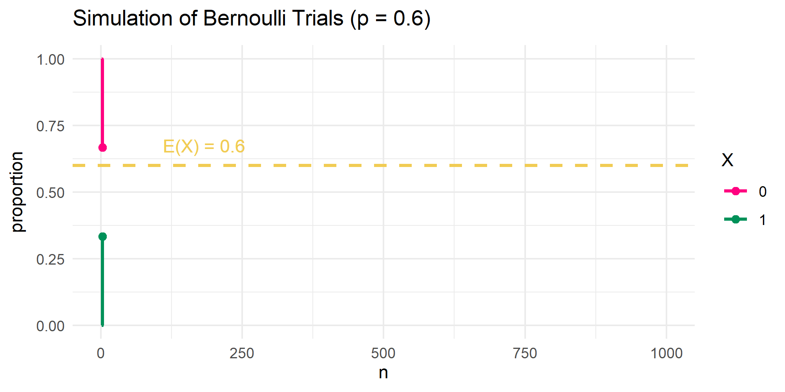

```{r setup, include=FALSE}
knitr::opts_chunk$set(echo = FALSE)
```

```{r echo=FALSE, eval=TRUE,message=FALSE, warning=FALSE}
library(tidyverse)
library(openintro)
library(gridExtra)
data(COL)
seed <- 42
```

## Objectives

:::: {.column width=15%}
::::

:::: {.column width=70%}
- **Develop an understanding of the Law of Large Numbers**
- **Introduce the concept of the long-run average outcome**
- **Know how to simulate random sampling in R**
- **Activity: Simulate Multiple Bernoulli Trials**
::::

:::: {.column width=15%}
::::

## Previously... (1/2)

**Interpreting Probability**

Frequentist probability refers to the interpretation of probability based on the long-run frequency of an event occurring in repeated trials or experiments.

**The Expected Value**

For a discrete r.v. $X$, the **expected value** is given by $$\text{E}(X) = \sum_{i=1}^{n} x_i P(X = x_i), \ \text{ for } \ i = 1,2, \cdots n$$ where $P(X = x_i)$ represents the PMF of $X$ evaluated at $x_i$.

**The Variance**

For a r.v. $X$, the **variance** is given by $$\text{Var}(X) = \text{E}\left(X^2 \right) - \left( \text{E}(X) \right)^2$$ where $\text{E}\left(X^2 \right) = \sum_{i=1}^{n} x_i^2 P(X = x_i)$ is the 2nd raw moment for a discrete r.v..

## Previously... (2/2)

A **Bernoulli r.v.** represents a single experiment with two possible outcomes: "success" ($X=1$) with probability $p$ and failure ($X=0$) with probability $1-p$. We denote this r.v. and its PMF as
\[
\begin{aligned}
\text{R.V. } & \longrightarrow X \sim \text{Bern}(p) \\
\text{PMF } & \longrightarrow P(X = x) = p^x (1-p)^{1-x}, \ \ x \in \{0,1\}
\end{aligned}.
\]

We have shown that the expected value of $X$ is $\text{E}(X) = p$ and the variance of $X$ is $\text{Var}(X) = p(1-p)$ using the definition of expected value and variance respectively.

## Visualizing the Bernoulli PMF {.smaller}

The **Bernoulli PMF** can be visualized using the vertical line plot because the Bernoulli r.v. is discrete.

**Example:** Suppose that $p=0.60$, meaning the the "success" probability is $P(X=1)=0.60$ and the "failure" probability is $P(X=0)=0.40$.

```{r eval=TRUE, echo=TRUE, message=FALSE, warning=FALSE, fig.align='center',fig.width=5,fig.height=3,out.width='60%'}
# set Bernoulli parameter
p <- 0.6

# set PMF of the Bernoulli r.v.
pmf <- tibble(x=c("0","1"),
              p=c(1-p,p))

# plot the Bernoulli distribution and store it into a R variable
p1 <- ggplot(pmf,aes(x=x,y=p)) + 
  geom_point(size=3) + # size here is defined for all points
  geom_segment(aes(x=x,xend=x,
                   y=c(0,0),yend=p)) + # draws a line between two defined points
  ggtitle(paste("Bernoulli PMF (p=",p,")",sep="")) + # sets the title of the plot
  ylim(0,1) + # set limits of the y-axis for viewing
  scale_x_discrete(labels=c("0"="0","1"="1")) + 
  theme_minimal() # set theme of entire plot

# display plot
p1
```

## Simulating Bernoulli Trials {.smaller}

A **Bernoulli trial** is a random experiment with two possible outcomes: success (1) or failure (0). The following R code sequence uses the `tidyverse` package.

```{r eval=TRUE, echo=TRUE, message=FALSE, warning=FALSE}
# set hyperparameters
set.seed(42) # for reproducibility
n <- 10 # number of trials

# set parameter and PMF of the Bernoulli r.v
X <- c("0","1") # outcomes ("0"="failure","1"="success")
p <- 0.6 # probability of success
bern_pmf <- c(1-p,p)

# simulate n Bernoulli trials
samples <- sample(X,size=n,prob=bern_pmf,replace=TRUE)

# convert samples into tibble form and compute proportions
samples_tib <- tibble(X=samples) %>% 
  group_by(X) %>% 
  summarise(count=n(),proportion=count/n)

# view tibble
samples_tib
```

## Visualizing the Simulated Bernoulli Trials {.smaller}

The Bernoulli trials simulations are considered nominal categorical data. A bar plot that shows the proportion of "success" and "failure" outcomes are most appropriate.

Here, we are using the `geom_col()` function instead of the `geom_bar()` because the data we are using is already summarized instead of the actual data.

```{r eval=TRUE, echo=TRUE, message=FALSE, warning=FALSE, fig.align='center',fig.width=5,fig.height=3,out.width='60%'}
# create the Bernoulli trials plot and store it into a R variable
p2 <- ggplot(samples_tib,aes(x=X,y=proportion)) + 
  geom_col(fill="#009159") + 
  ylim(0,1) + # set limits of the y-axis for viewing
  ggtitle(paste("Bernoulli Trials ","(n =",n,", p=",p,")",sep="")) + 
  theme_minimal() # set theme of entire plot

# display plot
p2
```

## Comparing the Bernoulli PMF vs the Trials {.smaller}

We can compare the Bernoulli PMF and the Trials by plotting the plots side-by-side for easy comparison. 

**Load Packages**

We using the the `gridExtra` package so that we can use the `grid.arrange()` function, which allows us to make subplots.

```{r eval=TRUE, echo=TRUE, message=FALSE, warning=FALSE}
library(gridExtra)
```

**Plot the Bernoulli PMF and the trials**

```{r eval=TRUE, echo=TRUE, message=FALSE, warning=FALSE, fig.align='center',fig.width=7,fig.height=3,out.width='60%'}
# view the Bernoulli PMF and the trials
grid.arrange(p1,p2,ncol=2)
```

::: {style="color: red;"}
$\star$ **Key Idea:** Since we only have 10 trials the proportions of the samples is not quite the same as the parameters of the Bernoulli r.v. due to sampling variability.
:::

## Increasing the Number of Bernoulli Trials {.smaller}

Suppose we increase the number of Bernoulli Trials and compare it to the Bernoulli PMF.

Let $p=0.60$ ("success" probability) and $n=1000$ (number of Bernoulli Trials).

```{r eval=TRUE, echo=FALSE, message=FALSE, warning=FALSE, fig.align='center',fig.width=7,fig.height=3,out.width='60%'}
# set hyperparameters
set.seed(42) # for reproducibility
n <- 1000 # number of trials

# set parameter and PMF of the Bernoulli r.v
X <- c("0","1") # outcomes ("0"="failure","1"="success")
p <- 0.6 # probability of success
bern_pmf <- c(1-p,p)

# simulate n Bernoulli trials
samples <- sample(X,size=n,prob=bern_pmf,replace=TRUE)

# convert samples into tibble form and compute proportions
samples_tib <- tibble(X=samples) %>% 
  group_by(X) %>% 
  summarise(count=n(),proportion=count/n)

# create the Bernoulli trials plot and store it into a R variable
p2 <- ggplot(samples_tib,aes(x=X,y=proportion)) + 
  geom_col(fill="#009159") + 
  ylim(0,1) + # set limits of the y-axis for viewing
  ggtitle(paste("Bernoulli Trials ","(n =",n,", p=",p,")",sep="")) + 
  theme_minimal() # set theme of entire plot

# view the Bernoulli PMF and the trials
grid.arrange(p1,p2,ncol=2)
```

::: {style="color: red;"}
$\star$ **Key Idea:** As we increase the number of Bernoulli trials from $n=10$ to $n=1000$, the proportion of $H$ and $T$ are close to the Bernoulli PMF, which shows the frequentist interpretation of Probability.
:::

## The Law of Large Numbers {.smaller}

The **Law of Large Numbers** states that as the number of trials in a random experiment increases, the sample mean approaches the expected value.

**Example Bernoulli Trials Simulation** 

Let $p=0.60$ be the "success" probability of a Bernoulli r.v. $X$, where $\text{E}(X) = p$. 

```{r echo=FALSE, eval=TRUE, fig.align='center', out.width='70%', message=FALSE, warning=FALSE}

```

::: {style="color: red;"}
$\star$ **Key Idea:** By the Law of Large Numbers, as the number of Bernoulli trials increases, the sample proportion of "success" converges to the expected value.
:::

## Activity: Simulate Multiple Bernoulli Trials

1. Log-in to Posit Cloud and open the R Studio assignment *M 2/10 - Simulate Multiple Bernoulli Trials*.
2. Make sure you are in the current working directory. Rename the `.Rmd` file by replacing `[name]` with your name using the format `[First name][Last initial]`. Then, open the `.Rmd` file.
3. Change the author in the YAML header.
4. Read the provided instructions.
5. Answer all exercise problems on the designated sections.

## References

::: {#refs}
:::
