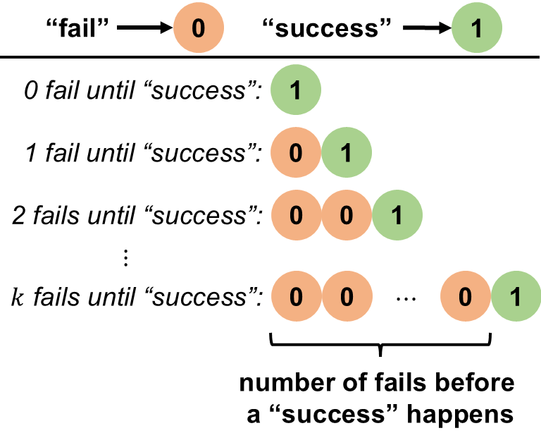
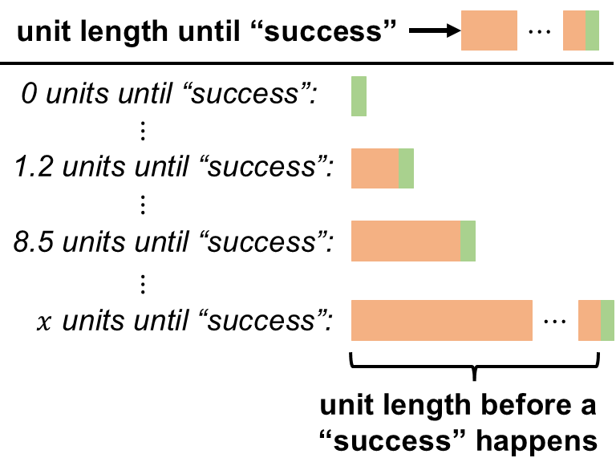

```{r setup, include=FALSE}
knitr::opts_chunk$set(echo = FALSE)
```

```{r echo=FALSE, eval=TRUE,message=FALSE, warning=FALSE}
library(tidyverse)
library(openintro)
library(gghighlight)
library(latex2exp)
data(COL)
seed <- 42
```

## Objectives

:::: {.column width=15%}
::::

:::: {.column width=70%}
- **Develop and understanding of the binomial and geometric distributions**
- **Know how to compute binomial and geometric probabilities using R**
- **Introduce how to simulate binomial and geometric random sampling in R**
- **Activity: Distinguish Between Geometric or Exponential R.V.**
::::

:::: {.column width=15%}
::::

## Previously... (1/2)

**Random Variables**

A random variable (r.v.) is a function that maps the sample space into real numbers.

**Probability Functions**

A probability function maps the r.v. into the the real numbers between 0 and 1.

There are two types of r.v.s --discrete and continuous-- with corresponding probability functions --probability mass function (PMF) and probability density function (PDF) respectively.

## Previously... (2/2)

**Geometric R.V.**

\[
\begin{aligned}
\text{R.V. } & \longrightarrow X \sim \text{Geom}(p) \\
\text{PMF } & \longrightarrow P(X=k) = (1-p)^k p \\
\text{for } & k = 0,1,2, \cdots \\
\text{expected value} & \longrightarrow \text{E}(X) = \frac{1-p}{p}
\end{aligned}
\]

**Binomial R.V.**

\[
\begin{aligned}
\text{R.V. } & \longrightarrow X \sim \text{Binom}(p) \\
\text{PMF } & \longrightarrow P(X=k) = \binom{n}{k} p^k (1-p)^{n-k} \\
\text{for } & k = 0,1,2,3, \cdots, n \\
\text{expected value} & \longrightarrow \text{E}(X) = np
\end{aligned}
\]

## Rate to "Success" (Discrete)

:::: {.column width=50%}
```{r echo=FALSE, fig.align='center', out.width = '100%'}

```
:::

:::: {.column width=49%}
**Geometric R.V. (Revisited)**

- Independent Bernoulli trials with "success" probability $p$
- Count the number of "fail" trials before the first "success"
- The probability of getting $k$ number of "fail" before a "success" follows the Geometric PMF
- The expected number of fails before a "success" is $\frac{1-p}{p}$
::::

::: {style="color: red;"}
$\star$ **Key Idea:** In a time-based interpretation, if events occur in discrete time steps, the geometric r.v. represents the number of time steps required until an event of interest happens.
:::

## Case Study 1

A professor allows students to take a short assessment quiz, and if they do not pass, they can revise their answers and retake the quiz in the next session. The probability that a student passes on any given attempt is $p=0.40$, and attempts continue until the student passes.

Let $X$ be the number of "fail" attempts before the student get a "pass".

:::: {.column width=49%}
**Information Given:**

* R.V. is $X \sim \text{Geom}(p)$
* Expected value is $\text{E}(X) = \frac{1-p}{p}$
* What is the expected number of "fail" until a student get a "pass"? $$\text{E}(X) = \frac{1-0.40}{0.40} = 1.5$$
::::

:::: {.column width=49%}
**Computing Probabilities:**

* Geometric PMF is $P(X=k) = (1-p)^k p$
* What is the probability that a student get a "pass" with at most $1$ "fail" attempt? 
$$
\begin{aligned}
P(X \le 1) & = \sum_{k=0}^1 P(X=k) \\
           & = (0.60)^0 (0.40) + (0.60)^1 (0.40) \\
P(X \le 1) & = 0.64
\end{aligned}
$$

**Using R:**

```{r echo=TRUE, eval=TRUE}
p <- 0.40
pgeom(1,p)
```

::::

::: {style="color: red;"}
This means that, on average, the student would "fail" on their 1st attempt before they get a "pass". The chances of a "pass" with 1 "fail" attempt is $0.64$.
:::

## Rate to "Success" (Continuous)

:::: {.column width=50%}
```{r echo=FALSE, fig.align='center', out.width = '100%'}

```
:::

:::: {.column width=49%}
**Exponential R.V.**

- Unit length until an event occurs
- "success" event happens at a constant rate
::::

::: {style="color: red;"}
$\star$ **Key Idea:** In a time-based interpretation, if events occur in continuous time, the exponential r.v. represents the length of time required until an event of interest happens.
:::

## The Exponential R.V.

The **exponential r.v.** is a continuous r.v. that models the time until an event occurs, given that the event happens at a constant rate over time called $\lambda$: $$X \sim \text{Exp}(\lambda)$$

**Sample Space:**

* $x \in [0,\infty)$ because the length of time until an event occurs can be any positive unit length

**Rate Parameter**

* $\lambda$ is reciprocal to the average time of an event occurs.
* This means that --on average-- $\frac{1}{\lambda}$ "success" occurs per unit length.

## The Exponential R.V.: PDF

The exponential r.v. $X \sim \text{Exp}(\lambda)$ has infinite possible outcomes (or infinite sized sample space) where $\lambda > 0$ is the rate of "success" with PDF given as $$f(x) = \lambda e^{-\lambda x}, \ x \ge 0$$

::: {style="color: red;"}
$\star$ **Key Idea:** The exponential r.v. models the unit length until an event happens.
:::

## Probabilities of PDFs

A **Probability Density Function (PDF)** $f(x)$ describes the likelihood of a continuous r.v. taking a specific value.

* The probability of a single point is zero for continuous distributions: $$P(X = x) = 0, \ \text{for any } x$$ because continuous distributions are defined over an infinite number of possible values, and the probability at a single point is infinitesimally small.

* Instead, we calculate probabilities over intervals using integration: 

  - Cumulative $\longrightarrow \displaystyle P(X \le x) = \int_{-\infty}^x f(t) \ dt$
  - Interval $\longrightarrow \displaystyle P(a \le X \le b) = \int_a^b f(t) \ dt$

::: {style="color: red;"}
$\star$ **Key Idea:**

* PMF (discrete r.v.): $P(X=k)$ is a meaningful probability
* PDF (continuous r.v.): $P(X=x)=0$, but density matters for interval probabilities.
:::

## Case Study 2

A class of students is taking a quiz, and the time it takes for students to finish the quiz follows an exponential r.v., assuming unlimited quiz time allocation. On average, a student takes 15 minutes to complete the quiz.

Let $X$ represent the time to finish the quiz.

:::: {.column width=49%}
**Information Given:**

* The time it takes for a student to finish a quiz follows an exponential distribution: $$X \sim \text{Exp}(\lambda)$$ where $\lambda$ is the rate parameter.
* $\lambda = \frac{1}{15}$, which can be interpreted in two ways:
    - on average, one student finishes the quiz in 15 minutes
    - on average, a student finishes $\frac{1}{15}$ part of the quiz per minute
::::

:::: {.column width=50%}
**Computing Probabilities:**

* The exponential PDF is $$f(x) = \frac{1}{15} e^{-\frac{1}{15} x}$$
* What is the probability that a student finishes a quiz less than or equal to 15 minutes?
\[
\begin{aligned}
P(X \le 15) & = \int_0^{15} f(x) \ dx \\
            & = \int_0^{15} \frac{1}{15} e^{-\frac{1}{15} x} \ dx \\
P(X \le 15) & \approx 0.632
\end{aligned}
\]

**Using R:**

```{r echo=TRUE, eval=TRUE}
lambda <- 1/15
pexp(15,lambda)
```
::::

## Visualizing The Exponential Distribution

:::: {.column width=50%}
```{r eval=TRUE, echo=FALSE, message=FALSE, warning=FALSE, fig.align='center',fig.width=4,fig.height=3,out.width='100%'}
# exponential pdf
mean <- 15
lambda <- 1/mean
x_exp <- seq(0,60,0.10)
exp_pdf <- dexp(x_exp,lambda)

# convert pdf to tibble
df_exp <- tibble(x=x_exp,exp_pdf=exp_pdf)

# plot the exponential distribution
ggplot(df_exp,aes(x=x,y=exp_pdf)) + 
  geom_line(color="#009159",linewidth=1) + 
  xlab("x") + 
  ylab("density") + 
  ggtitle(TeX(paste("Exponential Distribution ","$\\lambda$","=","$\\frac{1}{",mean,"}$"))) + # sets the title of the plot
  theme_minimal()
```
::::

:::: {.column width=49%}
**The Exponential R.V.**

\[
\begin{aligned}
\text{R.V. } & \longrightarrow X \sim \text{Exp}(\lambda) \\
\text{PDF } & \longrightarrow f(x) = \lambda e^{- \lambda x} \\
\text{for } & x \in [0,\infty)
\end{aligned}
\]
::::

## The Normal R.V.: A Preview

```{r eval=TRUE, echo=FALSE, message=FALSE, warning=FALSE, fig.align='center',fig.width=7,fig.height=3,out.width='80%'}
# binomial pmf
p <- 0.50
n <- 20
x_binom <- seq(0,n)
binom_pmf <- dbinom(x_binom,n,p)

# normal pdf
mu <- n*p
sigma <- sqrt(n*p*(1-p))
x_norm <- seq(0,n,0.10)
norm_pdf <- dnorm(x_norm,mu,sigma)

# convert pmf and pdf into tibble
df_binom <- tibble(x=x_binom, binom_pmf=binom_pmf)
df_norm <- tibble(x=x_norm, norm_pdf=norm_pdf)

# plot the Bernoulli distribution and store it into a R variable
p1 <- ggplot(df_binom,aes(x=x,y=binom_pmf)) + 
  geom_point(size=3,aes(color="Binomal PMF")) + # size here is defined for all points
  geom_segment(aes(x=x,xend=x, # draws a line between two defined points
                   y=rep(0,length(x)),yend=binom_pmf), 
                   color="black") + 
  geom_line(data=df_norm,aes(x=x,y=norm_pdf, color="Normal PDF"), linewidth=1) + 
  ylab("density") + 
  scale_color_manual(values=c("Binomal PMF"="black","Normal PDF"="#009159")) +
  ggtitle("Binomial vs Normal Distributions") + # sets the title of the plot
  theme_minimal() + # set theme of entire plot
  theme(legend.title=element_blank())

# display plot
p1
```

::: {style="color: red;"}
$\star$ **Key Idea:** The Binomial distribution can be approximated by a Normal distribution using the Central Limit Theorem (CLT). *We will discuss this topic soon.*
:::

## Activity: Distinguish Between Geometric or Exponential R.V.

1. Make sure you have a copy of the *W 2/19 - Distinguish Between Geometric or Exponential R.V.*. This will be handed out physically and it is also digitally available on Moodle.
2. Work on your worksheet by yourself for 10 minutes. Please read the instructions carefully. Ask questions if anything need clarifications.
3. Get together with another student.
4. Discuss your results.
5. Submit your worksheet on Moodle as a `.pdf` file.

## References

::: {#refs}
:::
