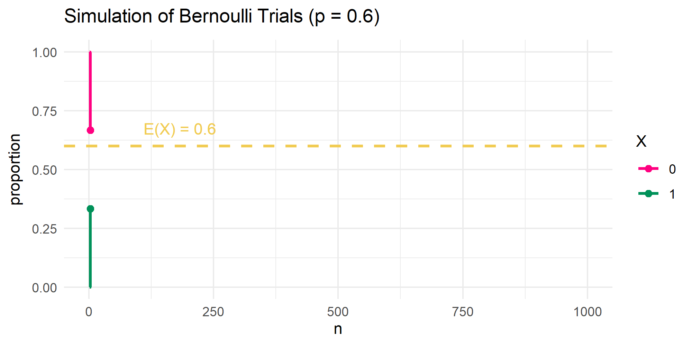
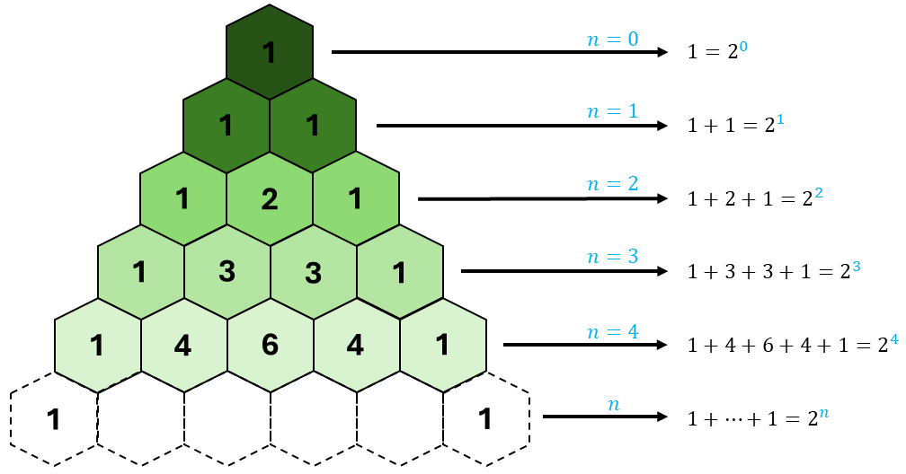
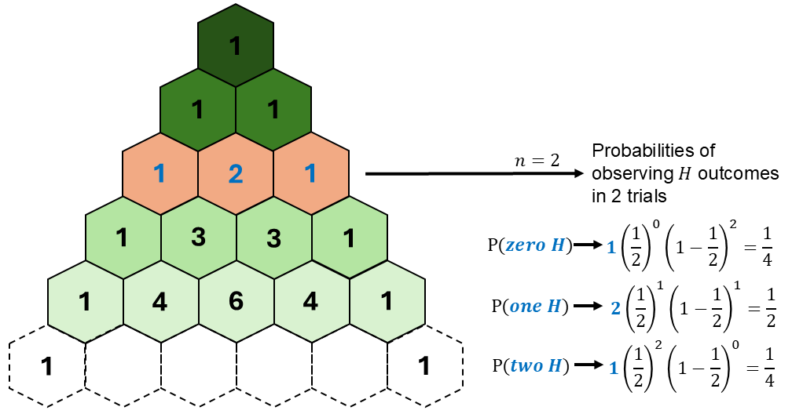

```{r setup, include=FALSE}
knitr::opts_chunk$set(echo = FALSE)
```

```{r echo=FALSE, eval=TRUE,message=FALSE, warning=FALSE}
library(tidyverse)
library(openintro)
library(gghighlight)
library(latex2exp)
data(COL)
seed <- 42
```

## Objectives

:::: {.column width=15%}
::::

:::: {.column width=70%}
- **Know how to compute exponential probabilities using R**
- **Know how to simulate exponential distribution in R**
- **Introduce the normal distribution**
- **Activity: The Galton Board and Normal Distribution**
::::

:::: {.column width=15%}
::::

## Previously...

**The Law of Large Numbers**

It states that as the number of trials in a random experiment increases, the sample mean approaches the expected value.

**Example Bernoulli Trials Simulation** 

Let $p=0.60$ be the "success" probability of a Bernoulli r.v. $X$, where $\text{E}(X) = p$. 

```{r echo=FALSE, eval=TRUE, fig.align='center', out.width='70%', message=FALSE, warning=FALSE}

```

## Visualizing the Exponential Distribution

:::: {.column width=50%}
**Exponential Distribution**

```{r eval=TRUE, echo=FALSE, message=FALSE, warning=FALSE, fig.align='center',fig.width=5,fig.height=3,out.width='100%'}
# set parameters, outcomes, and probabilities
mean <- 15
lambda <- 1/15 # set "success" probability
x_outcomes <- seq(0,60,0.10) # set outcome from 0 to 60 (technically infinite)
exp_pdf <- dexp(x_outcomes,lambda) # function `dexp()` is the Exponential PDF 
df <- tibble(x=x_outcomes, pmf=exp_pdf) # convert to tibble

# plot the Bernoulli distribution and store it into a R variable
p1 <- ggplot(df,aes(x=x,y=pmf)) + 
  geom_line(size=1,color="black") + # size here is defined for all points
  ggtitle(TeX(paste("Exponential Distribution ","$\\lambda$","=","$\\frac{1}{",mean,"}$"))) + # sets the title of the plot
  theme_minimal() # set theme of entire plot

# display plot
p1
```
::::

:::: {.column width=49%}
**Exponential R.V.**

Let $\lambda=\frac{1}{15}$ be the success probability.

\[
\begin{aligned}
\text{R.V. } & \longrightarrow X \sim \text{Exp}\left(\frac{1}{15}\right) \\
\text{PDF } & \longrightarrow f(x) = \frac{1}{15} e^{- \frac{1}{15} x} \\
\text{for } & x \in [0,\infty)
\end{aligned}
\]
::::

## Exponential Probabilities

:::: {.column width=50%}
**Exponential Distribution**

```{r eval=TRUE, echo=FALSE, message=FALSE, warning=FALSE, fig.align='center',fig.width=5,fig.height=3,out.width='100%'}
# set parameters, outcomes, and probabilities
mean <- 15
lambda <- 1/15 # set "success" probability
x_outcomes <- seq(0,60,0.10) # set outcome from 0 to 60 (technically infinite)
exp_pdf <- dexp(x_outcomes,lambda) # function `dexp()` is the Exponential PDF 
df <- tibble(x=x_outcomes, pmf=exp_pdf) # convert to tibble

# plot the Bernoulli distribution and store it into a R variable
p1 <- ggplot(df,aes(x=x,y=pmf)) + 
  geom_line(size=1,color="black") + # size here is defined for all points
  geom_ribbon(data=subset(df,x>=0 & x<=mean),aes(x=x,ymax=dexp(x,lambda)),ymin=0,alpha=0.3,fill="blue") +
  ggtitle(TeX(paste("Exponential Distribution ","$\\lambda$","=","$\\frac{1}{",mean,"}$"))) + # sets the title of the plot
  theme_minimal() # set theme of entire plot

# display plot
p1
```
::::

:::: {.column width=49%}
**Example:**

What is the probability that "success" happens on 15 unit length or less, given $\lambda=\frac{1}{15}$? 
\[
\begin{aligned}
P(X \le 15) & = \int_0^{15} f(x) \ dx \\
            & = \int_0^{15} \frac{1}{15} e^{-\frac{1}{15} x} \ dx \\
P(X \le 15) & \approx 0.632
\end{aligned}
\]

**Using R:**

```{r echo=TRUE, eval=TRUE}
lambda <- 1/15
pexp(15,lambda)
```
::::

::: {style="color: red;"}
$\star$ Note that the `pexp()` function computes the probability $P(X \le x)$, meaning it computes the sum of all probabilities from $X=0$ to $X=x$ using the Exponential PDF. The `dexp()` function computes the density, not probability because $P(X = x)=0$ at any $x$.
:::

## Exponential Expected Value

:::: {.column width=50%}
**Exponential Distribution with Expected Value**

```{r eval=TRUE, echo=FALSE, message=FALSE, warning=FALSE, fig.align='center',fig.width=5,fig.height=3,out.width='100%'}
# set parameters, outcomes, and probabilities
mean <- 15
lambda <- 1/15 # set "success" probability
x_outcomes <- seq(0,60,0.10) # set outcome from 0 to 60 (technically infinite)
exp_pdf <- dexp(x_outcomes,lambda) # function `dexp()` is the Exponential PDF 
df <- tibble(x=x_outcomes, pmf=exp_pdf) # convert to tibble

# plot the Bernoulli distribution and store it into a R variable
p1 <- ggplot(df,aes(x=x,y=pmf)) + 
  geom_line(size=1,color="black") + # size here is defined for all points
  geom_vline(xintercept = mean, color="red", linewidth=1) + 
  ggtitle(TeX(paste("Exponential Distribution ","$\\lambda$","=","$\\frac{1}{",mean,"}$"))) + # sets the title of the plot
  theme_minimal() # set theme of entire plot

# display plot
p1
```
::::

:::: {.column width=49%}
**Exponential R.V.**

Let $\lambda=\frac{1}{15}$ be the success probability.

\[
\begin{aligned}
\text{R.V. } & \longrightarrow X \sim \text{Exp}\left(\frac{1}{15}\right) \\
\text{PDF } & \longrightarrow f(x) = \frac{1}{15} e^{- \frac{1}{15} x} \\
\text{for } & x \in [0,\infty) \\
\text{expected value} & \longrightarrow \text{E}(X) = 15
\end{aligned}
\]

In general, the expected value of the exponential r.v. is given by $$\text{E}(X) = \frac{1}{\lambda},$$ which is the reciprocal of the "success" rate.
::::

## Simulating the Exponential Distribution

:::: {.column width=50%}
**Random Sampling from the Exponential Distribution**

```{r eval=TRUE, echo=FALSE, message=FALSE, warning=FALSE, fig.align='center',fig.width=5,fig.height=3,out.width='100%'}
set.seed(seed)
# set parameters, outcomes, and probabilities
N <- 100 # number of simulations
lambda <- 1/mean # set "success" probability
x_outcomes <- seq(0,60,0.10) # set outcome from 0 to 60 (technically infinite)
exp_samples <- rexp(N,lambda) # function `rgeom()` is the sampling from Exponential PDF
exp_mean <- mean(exp_samples) # sample mean
df <- tibble(x=exp_samples) # convert to tibble

# plot the Bernoulli distribution and store it into a R variable
p1 <- ggplot(df,aes(x=x)) + 
  geom_histogram(bin=30) + 
  geom_vline(xintercept = exp_mean, color="pink", linewidth=1) + 
  geom_vline(xintercept = mean, color="red", linewidth=1) + 
  geom_text(aes(exp_mean,0),label = paste(TeX("E(X)")," = ",round(exp_mean,2),sep=""), 
            vjust = -5, hjust=-0.10,color="pink") + 
  geom_text(aes(mean,0),label = paste(TeX("E(X)")," = ",mean,sep=""), 
            vjust = -15, hjust=-0.10,color="red") + 
  ggtitle(TeX(paste("Exponential Distribution ","$\\lambda$","=","$\\frac{1}{",mean,"}$"))) + # sets the title of the plot
  theme_minimal() # set theme of entire plot

# display plot
p1
```
::::

:::: {.column width=49%}
**Sample Mean vs the Expected Value**

The sample mean of $0.88$ is not exactly equal to the expected value of $1$ due to sampling variability. As we increase the number of samples, the sample mean gets closer to the expectation.

**Geometric Random Sampling using R**

```{r echo=TRUE, eval=FALSE}
N <- 100 # number of simulations
mean <- 15
lambda <- 1/15 # set rate
rexp(N,lambda)
```
::::

## Binomial R.V. (Revisited)

:::: {.column width=50%}
**Binomial Distribution**

```{r eval=TRUE, echo=FALSE, message=FALSE, warning=FALSE, fig.align='center',fig.width=5,fig.height=3,out.width='100%'}
# set parameters, outcomes, and probabilities
n <- 10 # number of trials
p <- 0.5 # set "success" probability
x_outcomes <- seq(0,n,1) # set outcome from 0 to n
binom_pmf <- dbinom(x_outcomes,n,p) # function `dbinom()` is the Binomial PMF 
df <- tibble(x=x_outcomes, pmf=binom_pmf) # convert to tibble

# plot the Bernoulli distribution and store it into a R variable
p1 <- ggplot(df,aes(x=x,y=pmf)) + 
  geom_point(size=3,color="black") + # size here is defined for all points
  geom_segment(aes(x=x,xend=x, # draws a line between two defined points
                   y=rep(0,length(x)),yend=pmf), 
                   color="black") + 
  ggtitle(paste("Binomial PMF (n=",n,", p=",p,")",sep="")) + # sets the title of the plot
  scale_x_discrete(limits=x_outcomes) + 
  theme_minimal() # set theme of entire plot

# display plot
p1
```
::::

:::: {.column width=49%}
**Binomial R.V.**

Let $p=0.50$ be the success probability and $n=10$ the number of trials.

\[
\begin{aligned}
\text{R.V. } & \longrightarrow X \sim \text{Binom}(p) \\
\text{PMF } & \longrightarrow P(X=k) = \binom{n}{k} p^k (1-p)^{n-k} \\
\text{for } & k = 0,1,2,3, \cdots, n
\end{aligned}
\]
::::

## Flipping $\mathbf{n}$ Coins: Possible Outcomes

Suppose we conduct an experiment of flipping $n$ fair coins in a sequence, where $n$ is an integer. The sample space $S$ contains all possible sequences of $H$ and $T$. Number of possible outcomes is $|S| = 2^n$.

**Visualizing the possible outcomes using Pascal's triangle**

```{r pascals-triangle-row-sum, echo=FALSE, fig.cap="", out.width="60%", fig.align="center"}

```

::: {style="color: red;"}
$\star$ **Key Idea:** Pascal's Triangle helps us visualize the total possible sequences of "success" ($H$) outcomes given $n$ independent trials.
:::

## Flipping $\mathbf{n}$ Coins: Counting the Number of $H$ outcomes

Let $X$ be the r.v. that counts the number of $H$ outcomes in $n$ trials.

**Pascal's triangle helps us count**

```{r pascals-triangle-2trial-comb, echo=FALSE, fig.cap="", out.width="60%", fig.align="center"}
knitr::include_graphics("pascals-triangle-2trial-comb.png")
```

::: {style="color: blue;"}
$\dagger$ Can you determine the ways $H$ can occur in $4$ trials using Pascal's triangle?
:::

## Flipping $\mathbf{n}$ Coins: Probability of Observing $H$ outcomes in $n$ Trials

Compute the probability of observing a certain number of "success" ($H$) outcomes in $n$ trials.

```{r pascals-triangle-2trial-prob, echo=FALSE, fig.cap="", out.width="60%", fig.align="center"}

```

::: {style="color: blue;"}
$\dagger$ Can you determine the probabilities of observing $H$ outcomes in $4$ trials?
:::

## Flipping $\mathbf{n}$ Coins: The Expected Number of $H$ outcomes in $n$ Trials

How many $H$ outcomes do we expect to have in $n$ independent Bernoulli trials?

:::: {.column width=50%}
**Example**

* Each fair coin flip is an independent Bernoulli trial with:
  - $P(H) = \frac{1}{2}$
  - $P(T) = 1 - \frac{1}{2}$
* Suppose that $n=2$.
  - We expect to have $2 \times \frac{1}{2} = 1$ $H$ outcome in $2$ trials.
::::

:::: {.column width=49%}
**In general:**

- Let $p$ be the probability of "success" for each independent Bernoulli trial.
- Let $n$ be the number of trials.
- The expected value of "success" outcomes is $n \times p$.
::::

::: {style="color: red;"}
$\star$ **Key Idea:** expected number of successes in $n$ trials with success probability $p$. Over many repetitions, the long-run average number of successes is $n \times p$, reflecting the frequentist interpretation of probability.
:::

## Approximating the Binomial

**The Normal Approximation**

The binomial distribution can be approximated by a normal distribution with mean $\mu$ and variance $\sigma^2$ when:

* $n$ is sufficiently large
* $np \ge 5$ and $n(1-p) \ge 5$ (Rule of Thumb)

**Mean and Standard Deviation of the Normal Approximation**

* Mean: $\mu = np$
* Variance: $\sigma^2 = np(1-p)$
* Standard Deviation: $\sigma = \sqrt{np(1-p)}$

## The Normal Distribution

```{r eval=TRUE, echo=FALSE, message=FALSE, warning=FALSE, fig.align='center',fig.width=7,fig.height=3,out.width='80%'}
# binomial pmf
p <- 0.50
n <- 20
x_binom <- seq(0,n)
binom_pmf <- dbinom(x_binom,n,p)

# normal pdf
mu <- n*p
sigma <- sqrt(n*p*(1-p))
x_norm <- seq(0,n,0.10)
norm_pdf <- dnorm(x_norm,mu,sigma)

# convert pmf and pdf into tibble
df_binom <- tibble(x=x_binom, binom_pmf=binom_pmf)
df_norm <- tibble(x=x_norm, norm_pdf=norm_pdf)

# plot the Bernoulli distribution and store it into a R variable
p1 <- ggplot(df_binom,aes(x=x,y=binom_pmf)) + 
  geom_point(size=3,aes(color="Binomal PMF")) + # size here is defined for all points
  geom_segment(aes(x=x,xend=x, # draws a line between two defined points
                   y=rep(0,length(x)),yend=binom_pmf), 
                   color="black") + 
  geom_line(data=df_norm,aes(x=x,y=norm_pdf, color="Normal PDF"), linewidth=1) + 
  ylab("density") + 
  scale_color_manual(values=c("Binomal PMF"="black","Normal PDF"="#009159")) +
  ggtitle("Binomial vs Normal Distributions") + # sets the title of the plot
  theme_minimal() + # set theme of entire plot
  theme(legend.title=element_blank())

# display plot
p1
```

::: {style="color: red;"}
$\star$ **Key Idea:** The Binomial distribution is approximately the normal distribution given large enough samples because of the Law of Large Numbers.
:::

## The Galton Board and the Normal Distribution

https://youtu.be/UCmPmkHqHXk?si=0npB9FARd3Xt5UwD

## Activity: The Galton Board and Normal Distribution

1. Make sure you have a copy of the *W 2/19 - The Galton Board and Normal Distribution*. This will be handed out physically and it is also digitally available on Moodle.
2. Work on your worksheet by yourself for 10 minutes. Please read the instructions carefully. Ask questions if anything need clarifications.
3. Get together with another student.
4. Discuss your results.
5. Submit your worksheet on Moodle as a `.pdf` file.

## References

::: {#refs}
:::
