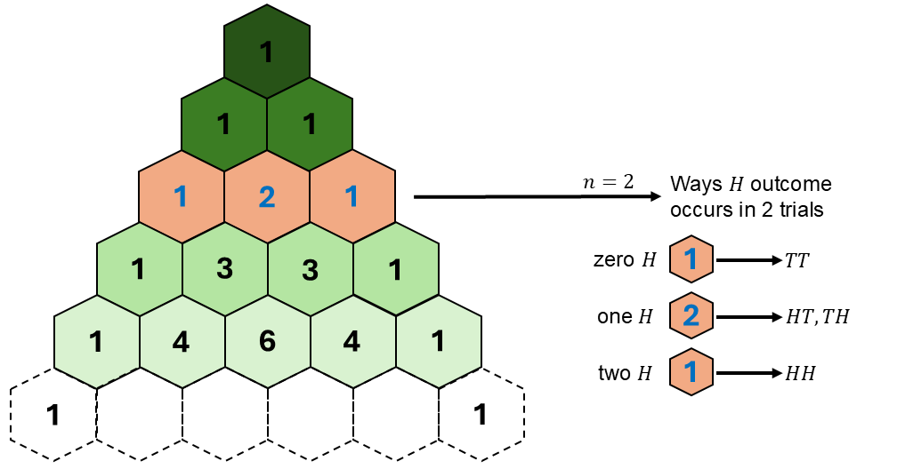

```{r setup, include=FALSE}
knitr::opts_chunk$set(echo = FALSE)
```

```{r echo=FALSE, eval=TRUE,message=FALSE, warning=FALSE}
library(tidyverse)
library(openintro)
library(gghighlight)
library(latex2exp)
data(COL)
seed <- 42
```

## Objectives

:::: {.column width=15%}
::::

:::: {.column width=70%}
- **Develop and understanding of the exponential and normal distributions**
- **Know how to compute exponential and normal probabilities using R**
- **Introduce how to simulate exponential and normal random sampling in R**
- **Activity: The Galton Board and Normal Distribution**
::::

:::: {.column width=15%}
::::

## Previously...

**The Law of Large Numbers**

It states that as the number of trials in a random experiment increases, the sample mean approaches the expected value.

**Example Bernoulli Trials Simulation** 

Let $p=0.60$ be the "success" probability of a Bernoulli r.v. $X$, where $\text{E}(X) = p$. 

```{r echo=FALSE, eval=TRUE, fig.align='center', out.width='70%', message=FALSE, warning=FALSE}
knitr::include_graphics("bernoulli-loln-sim.gif")
```

## Visualizing the Exponential Distribution

:::: {.column width=50%}
**Exponential Distribution**

```{r eval=TRUE, echo=FALSE, message=FALSE, warning=FALSE, fig.align='center',fig.width=5,fig.height=3,out.width='100%'}
# set parameters, outcomes, and probabilities
mean <- 15
lambda <- 1/15 # set "success" probability
x_outcomes <- seq(0,60,0.10) # set outcome from 0 to 60 (technically infinite)
exp_pdf <- dexp(x_outcomes,lambda) # function `dexp()` is the Exponential PDF 
df <- tibble(x=x_outcomes, pmf=exp_pdf) # convert to tibble

# plot the Bernoulli distribution and store it into a R variable
p1 <- ggplot(df,aes(x=x,y=pmf)) + 
  geom_line(size=1,color="black") + # size here is defined for all points
  ggtitle(TeX(paste("Exponential Distribution ","$\\lambda$","=","$\\frac{1}{",mean,"}$"))) + # sets the title of the plot
  theme_minimal() # set theme of entire plot

# display plot
p1
```
::::

:::: {.column width=49%}
**Exponential R.V.**

Let $\lambda=\frac{1}{15}$ be the rate of "success".

\[
\begin{aligned}
\text{R.V. } & \longrightarrow X \sim \text{Exp}\left(\frac{1}{15}\right) \\
\text{PDF } & \longrightarrow f(x) = \frac{1}{15} e^{- \frac{1}{15} x} \\
\text{for } & x \in [0,\infty)
\end{aligned}
\]
::::

## Exponential Probabilities

:::: {.column width=50%}
**Exponential Distribution**

```{r eval=TRUE, echo=FALSE, message=FALSE, warning=FALSE, fig.align='center',fig.width=5,fig.height=3,out.width='100%'}
# set parameters, outcomes, and probabilities
mean <- 15
lambda <- 1/15 # set "success" probability
x_outcomes <- seq(0,60,0.10) # set outcome from 0 to 60 (technically infinite)
exp_pdf <- dexp(x_outcomes,lambda) # function `dexp()` is the Exponential PDF 
df <- tibble(x=x_outcomes, pmf=exp_pdf) # convert to tibble

# plot the Bernoulli distribution and store it into a R variable
p1 <- ggplot(df,aes(x=x,y=pmf)) + 
  geom_line(size=1,color="black") + # size here is defined for all points
  geom_ribbon(data=subset(df,x>=0 & x<=mean),aes(x=x,ymax=dexp(x,lambda)),ymin=0,alpha=0.3,fill="blue") +
  ggtitle(TeX(paste("Exponential Distribution ","$\\lambda$","=","$\\frac{1}{",mean,"}$"))) + # sets the title of the plot
  theme_minimal() # set theme of entire plot

# display plot
p1
```
::::

:::: {.column width=49%}
**Example:**

What is the probability that "success" happens on 15 unit length or less, given $\lambda=\frac{1}{15}$? 
\[
\begin{aligned}
P(X \le 15) & = \int_0^{15} f(x) \ dx \\
            & = \int_0^{15} \frac{1}{15} e^{-\frac{1}{15} x} \ dx \\
P(X \le 15) & \approx 0.632
\end{aligned}
\]

**Using R:**

```{r echo=TRUE, eval=TRUE}
lambda <- 1/15
pexp(15,lambda)
```
::::

::: {style="color: red;"}
$\star$ Note that the `pexp()` function computes the probability $P(X \le x)$, meaning it computes the sum of all probabilities from $X=0$ to $X=x$ using the Exponential PDF. The `dexp()` function computes the density, not probability because $P(X = x)=0$ at any $x$.
:::

## Exponential Expected Value

:::: {.column width=50%}
**Exponential Distribution with Expected Value**

```{r eval=TRUE, echo=FALSE, message=FALSE, warning=FALSE, fig.align='center',fig.width=5,fig.height=3,out.width='100%'}
# set parameters, outcomes, and probabilities
mean <- 15
lambda <- 1/15
x_outcomes <- seq(0,60,0.10) # set outcome from 0 to 60 (technically infinite)
exp_pdf <- dexp(x_outcomes,lambda) # function `dexp()` is the Exponential PDF 
df <- tibble(x=x_outcomes, pdf=exp_pdf) # convert to tibble

# plot the Bernoulli distribution and store it into a R variable
p1 <- ggplot(df,aes(x=x,y=pdf)) + 
  geom_line(size=1,color="black") + # size here is defined for all points
  geom_vline(xintercept = mean, color="red", linewidth=1) + 
  ggtitle(TeX(paste("Exponential Distribution ","$\\lambda$","=","$\\frac{1}{",mean,"}$"))) + # sets the title of the plot
  theme_minimal() # set theme of entire plot

# display plot
p1
```
::::

:::: {.column width=49%}
**Exponential R.V.**

Let $\lambda=\frac{1}{15}$ be the rate of "success".

\[
\begin{aligned}
\text{R.V. } & \longrightarrow X \sim \text{Exp}\left(\frac{1}{15}\right) \\
\text{PDF } & \longrightarrow f(x) = \frac{1}{15} e^{- \frac{1}{15} x} \\
\text{for } & x \in [0,\infty) \\
\text{expected value} & \longrightarrow \text{E}(X) = 15
\end{aligned}
\]

In general, the expected value of the exponential r.v. is given by $$\text{E}(X) = \frac{1}{\lambda},$$ which is the reciprocal of the "success" rate.
::::

## Simulating the Exponential Distribution

:::: {.column width=50%}
**Random Sampling from the Exponential Distribution**

```{r eval=TRUE, echo=FALSE, message=FALSE, warning=FALSE, fig.align='center',fig.width=5,fig.height=3,out.width='100%'}
set.seed(seed)
# set parameters, outcomes, and probabilities
N <- 100 # number of simulations
lambda <- 1/mean # set "success" probability
x_outcomes <- seq(0,60,0.10) # set outcome from 0 to 60 (technically infinite)
exp_samples <- rexp(N,lambda) # function `rexp()` is the sampling from Exponential PDF
exp_mean <- mean(exp_samples) # sample mean
df <- tibble(x=exp_samples) # convert to tibble

# plot the Bernoulli distribution and store it into a R variable
p1 <- ggplot(df,aes(x=x)) + 
  geom_histogram(bin=30) + 
  geom_vline(xintercept = exp_mean, color="pink", linewidth=1) + 
  geom_vline(xintercept = mean, color="red", linewidth=1) + 
  geom_text(aes(exp_mean,0),label = paste(TeX("E(X)")," = ",round(exp_mean,2),sep=""), 
            vjust = -5, hjust=-0.10,color="pink") + 
  geom_text(aes(mean,0),label = paste(TeX("E(X)")," = ",mean,sep=""), 
            vjust = -15, hjust=-0.10,color="red") + 
  ggtitle(TeX(paste("Exponential Distribution ","$\\lambda$","=","$\\frac{1}{",mean,"}$"))) + # sets the title of the plot
  theme_minimal() # set theme of entire plot

# display plot
p1
```
::::

:::: {.column width=49%}
**Sample Mean vs the Expected Value**

The sample mean of $0.88$ is not exactly equal to the expected value of $1$ due to sampling variability. As we increase the number of samples, the sample mean gets closer to the expectation.

**Geometric Random Sampling using R**

```{r echo=TRUE, eval=FALSE}
N <- 100 # number of simulations
mean <- 15
lambda <- 1/15 # set rate
rexp(N,lambda)
```
::::

## Binomial R.V. (Revisited)

:::: {.column width=50%}
**Binomial Distribution**

```{r eval=TRUE, echo=FALSE, message=FALSE, warning=FALSE, fig.align='center',fig.width=5,fig.height=3,out.width='100%'}
# set parameters, outcomes, and probabilities
n <- 10 # number of trials
p <- 0.5 # set "success" probability
x_outcomes <- seq(0,n,1) # set outcome from 0 to n
binom_pmf <- dbinom(x_outcomes,n,p) # function `dbinom()` is the Binomial PMF 
binom_ev <- n*p # expected value
df <- tibble(x=x_outcomes, pmf=binom_pmf) # convert to tibble

# plot the Bernoulli distribution and store it into a R variable
p1 <- ggplot(df,aes(x=x,y=pmf)) + 
  geom_point(size=3,color="black") + # size here is defined for all points
  geom_segment(aes(x=x,xend=x, # draws a line between two defined points
                   y=rep(0,length(x)),yend=pmf), 
                   color="black") + 
  geom_vline(xintercept = n*p, color="red", linewidth=1) + 
  geom_text(aes(binom_ev,0),label = paste(TeX("E(X)")," = ",binom_ev,sep=""), 
            vjust = -15, hjust=-0.10,color="red") + 
  ggtitle(paste("Binomial PMF (n=",n,", p=",p,")",sep="")) + # sets the title of the plot
  scale_x_discrete(limits=x_outcomes) + 
  theme_minimal() # set theme of entire plot

# display plot
p1
```
::::

:::: {.column width=49%}
**Binomial R.V.**

Let $p=0.50$ be the success probability and $n=10$ the number of trials.

\[
\begin{aligned}
\text{R.V. } & \longrightarrow X \sim \text{Binom}(n,p) \\
\text{PMF } & \longrightarrow P(X=k) = \binom{n}{k} p^k (1-p)^{n-k} \\
\text{for } & k = 0,1,2,3, \cdots, n \\
\text{expected value} & \longrightarrow \text{E}(X) \approx 5
\end{aligned}
\]
::::

## Flipping $\mathbf{n}$ Coins: Possible Outcomes

Suppose we conduct an experiment of flipping $n$ fair coins in a sequence, where $n$ is an integer. The sample space $S$ contains all possible sequences of $H$ and $T$. Number of possible outcomes is $|S| = 2^n$.

**Visualizing the possible outcomes using Pascal's triangle**

```{r pascals-triangle-row-sum, echo=FALSE, fig.cap="", out.width="60%", fig.align="center"}
knitr::include_graphics("pascals-triangle-row-sum.png")
```

::: {style="color: red;"}
$\star$ **Key Idea:** Pascal's Triangle helps us visualize the total possible sequences of "success" ($H$) outcomes given $n$ independent trials.
:::

## Flipping $\mathbf{n}$ Coins: Counting the Number of $H$ outcomes

Let $X$ be the r.v. that counts the number of $H$ outcomes in $n$ trials.

**Pascal's triangle helps us count**

```{r pascals-triangle-2trial-comb, echo=FALSE, fig.cap="", out.width="60%", fig.align="center"}

```

::: {style="color: blue;"}
$\dagger$ Can you determine the ways $H$ can occur in $4$ trials using Pascal's triangle?
:::

## Flipping $\mathbf{n}$ Coins: Probability of Observing $H$ outcomes in $n$ Trials

Compute the probability of observing a certain number of "success" ($H$) outcomes in $n$ trials.

```{r pascals-triangle-2trial-prob, echo=FALSE, fig.cap="", out.width="60%", fig.align="center"}
knitr::include_graphics("pascals-triangle-2trial-prob.png")
```

::: {style="color: blue;"}
$\dagger$ Can you determine the probabilities of observing $H$ outcomes in $4$ trials?
:::

## Flipping $\mathbf{n}$ Coins: The Expected Number of $H$ outcomes in $n$ Trials

How many $H$ outcomes do we expect to have in $n$ independent Bernoulli trials with "success" probability $p$?

:::: {.column width=50%}
**Example**

* Each fair coin flip is an independent Bernoulli trial with:
  - $P(H) = \frac{1}{2}$
  - $P(T) = 1 - \frac{1}{2}$
* Suppose that $n=2$.
  - We expect to have $2 \times \frac{1}{2} = 1$ $H$ outcome in $2$ trials.
::::

:::: {.column width=49%}
**In general:**

- The expected value of "success" outcomes is $\text{E}(X) = n \times p$.
- The binomial coefficient tells you how many ways $k$ "success" outcomes can occur in $n$ trials, corresponding to the $k$-th column in the $n$-th row of Pascal’s Triangle.
::::

::: {style="color: red;"}
$\star$ **Key Idea:** Over many repetitions, the long-run average number of "success" outcomes is $n \times p$, reflecting the frequentist interpretation of probability.
:::

## Normal Approximation to the Binomial

```{r eval=TRUE, echo=FALSE, message=FALSE, warning=FALSE, fig.align='center',fig.width=7,fig.height=3,out.width='80%'}
# binomial random samples using the binomial pmf
p <- 0.50
n <- 20
N <- 10000
x_binom <- seq(0,n)
binom_samples <- rbinom(N,n,p)

# normal pdf
mu <- n*p
sigma <- sqrt(n*p*(1-p))
x_norm <- seq(0,n,0.10)
norm_pdf <- dnorm(x_norm,mu,sigma)

# convert pmf and pdf into tibble
df_binom <- tibble(x=binom_samples) %>% 
  group_by(x) %>% 
  summarise(x_prop=n()/N)
df_norm <- tibble(x=x_norm, norm_pdf=norm_pdf)

# plot the Bernoulli distribution and store it into a R variable
p1 <- ggplot(df_binom,aes(x=x,y=x_prop)) + 
  geom_col(aes(fill="Binomial Samples")) + 
  geom_line(data=df_norm,aes(x=x,y=norm_pdf, color="Normal PDF"), linewidth=1) + 
  ylab("density") + 
  scale_color_manual(values=c("Normal PDF"="#009159")) +
  scale_fill_manual(values=c("Binomial Samples"="darkgray")) + 
  ggtitle("Binomial Samples Approximated by a Normal Distribution") + # sets the title of the plot
  theme_minimal() + # set theme of entire plot
  theme(legend.title=element_blank())

# display plot
p1
```

::: {style="color: red;"}
$\star$ **Key Idea:** The Binomial distribution is approximately the normal distribution given large enough samples because of the Law of Large Numbers.
:::

## The Normal R.V.

A **normal r.v.** is a type of continuous r.v. whose probability distribution follows the *normal distribution*, also known as the *Gaussian distribution*. The normal distribution is characterized by two parameters, $\mu$ as the mean and $\sigma^2$ as the variance: $$X \sim \text{N}(\mu,\sigma^2)$$

**Sample Space:**

* $x \in (-\infty,\infty)$ because the normal r.v. can take any value from the entire real number line and it is a continuous random variable.

**Parameters**

* $\mu$ is the mean (center) or the mode of the distribution.
* $\sigma^2$ measures the spread of the distribution.

## The Normal R.V.: PDF

The normal r.v. $X \sim \text{N}(\mu,\sigma^2)$ has infinite possible outcomes (or infinite sized sample space) where $\mu$ is the mean and $\sigma^2$ is the variance with PDF given as $$f(x) = \frac{1}{\sqrt{2 \pi \sigma^2}} e^{-\frac{(x-\mu)^2}{2\sigma^2}}, \ -\infty < x < \infty$$

::: {style="color: red;"}
$\star$ **Key Idea:** The normal r.v. often approximates the distribution of many types of data, especially when there are large numbers of independent factors contributing to the outcome.
:::

## Normal Probabilities

:::: {.column width=50%}
**Normal Distribution**

```{r eval=TRUE, echo=FALSE, message=FALSE, warning=FALSE, fig.align='center',fig.width=5,fig.height=3,out.width='100%'}
# set parameters, outcomes, and probabilities
mu <- 20*0.50
sd <- sqrt(20*0.50*(1-0.50))
x_outcomes <- seq(0,20,0.10) # set outcome from 0 to 20 (technically infinite)
norm_pdf <- dnorm(x_outcomes,mu,sd) # function `dnorm()` is the Normal PDF 
df <- tibble(x=x_outcomes, pdf=norm_pdf) # convert to tibble

# plot the Bernoulli distribution and store it into a R variable
p1 <- ggplot(df,aes(x=x,y=pdf)) + 
  geom_line(size=1,color="black") + # size here is defined for all points
  geom_ribbon(data=subset(df,x>=0 & x<=13),aes(x=x,ymax=dnorm(x,mu,sd)),ymin=0,alpha=0.3,fill="blue") +
  ggtitle(TeX(paste("Normal Distribution ","$\\mu$","=",mu," ","$s$","=",round(sd,2)))) + # sets the title of the plot
  theme_minimal() # set theme of entire plot

# display plot
p1
```
::::

:::: {.column width=49%}
**Example:**

What is $P(X \le 13)$ for $X \sim \text{N}(10,2.24)$? 
\[
\begin{aligned}
P(X \le 13) & = \int_0^{13} f(x) \ dx \\
            & = \int_0^{13} \frac{1}{\sqrt{2 \pi (2.24)^2}} e^{-\frac{(x-10)^2}{2(2.24)^2}} \ dx \\
P(X \le 13) & \approx 0.9098
\end{aligned}
\]

**Using R:**

```{r echo=TRUE, eval=TRUE}
mu <- 10
sd <- 2.24
pnorm(13,mu,sd)
```
::::

::: {style="color: red;"}
$\star$ Note that the `pnorm()` function computes the probability $P(X \le x)$, meaning it computes the area under $f(x)$ from $X=0$ to $X=x$ using the Normal PDF. The `dnorm()` function computes the density, not probability because $P(X = x)=0$ at any $x$.
:::

## Normal Expected Value

:::: {.column width=50%}
**Normal Distribution with Expected Value**

```{r eval=TRUE, echo=FALSE, message=FALSE, warning=FALSE, fig.align='center',fig.width=5,fig.height=3,out.width='100%'}
# set parameters, outcomes, and probabilities
mu <- 20*0.50
sd <- sqrt(20*0.50*(1-0.50))
x_outcomes <- seq(0,20,0.10) # set outcome from 0 to 20 (technically infinite)
norm_pdf <- dnorm(x_outcomes,mu,sd) # function `dnorm()` is the Normal PDF 
df <- tibble(x=x_outcomes, pdf=norm_pdf) # convert to tibble

# plot the Bernoulli distribution and store it into a R variable
p1 <- ggplot(df,aes(x=x,y=pdf)) + 
  geom_line(size=1,color="black") + # size here is defined for all points
  geom_vline(xintercept = mu, color="red", linewidth=1) + 
  ggtitle(TeX(paste("Normal Distribution ","$\\mu$","=",mu," ","$s$","=",round(sd,2)))) + # sets the title of the plot
  theme_minimal() # set theme of entire plot

# display plot
p1
```
::::

:::: {.column width=49%}
**Normal R.V.**

Let $\mu=10$ and $s=2.24$ be the mean and standard deviation respectively.

\[
\begin{aligned}
\text{R.V. } & \longrightarrow X \sim \text{N}\left(10,2.24^2\right) \\
\text{PDF } & \longrightarrow f(x) = \frac{1}{\sqrt{2 \pi (2.24)^2}} e^{-\frac{(x-10)^2}{2(2.24)^2}} \\
\text{for } & x \in (-\infty,\infty) \\
\text{expected value} & \longrightarrow \text{E}(X) = 10
\end{aligned}
\]

In general, the expected value of the normal r.v. is given by $$\text{E}(X) = \mu,$$ which is the center of the normal distribution.
::::

## Simulating the Normal Distribution

:::: {.column width=50%}
**Random Sampling from the Exponential Distribution**

```{r eval=TRUE, echo=FALSE, message=FALSE, warning=FALSE, fig.align='center',fig.width=5,fig.height=3,out.width='100%'}
set.seed(seed)
# set parameters, outcomes, and probabilities
N <- 100 # number of simulations
mu <- 20*0.50
sd <- sqrt(20*0.50*(1-0.50))
x_outcomes <- seq(0,20,0.10) # set outcome from 0 to 20 (technically infinite)
norm_samples <- rnorm(N,mu,sd) # function `rnorm()` is the sampling from Normal PDF
norm_mean <- mean(norm_samples) # sample mean
df <- tibble(x=norm_samples) # convert to tibble

# plot the Bernoulli distribution and store it into a R variable
p1 <- ggplot(df,aes(x=x)) + 
  geom_histogram(bin=30) + 
  geom_vline(xintercept = norm_mean, color="pink", linewidth=1) + 
  geom_vline(xintercept = mu, color="red", linewidth=1) + 
  geom_text(aes(norm_mean,0),label = paste(TeX("E(X)")," = ",round(norm_mean,2),sep=""), 
            vjust = -5, hjust=-0.10,color="pink") + 
  geom_text(aes(mu,0),label = paste(TeX("E(X)")," = ",mu,sep=""), 
            vjust = -15, hjust=-0.10,color="red") + 
  ggtitle(TeX(paste("Normal Distribution ","$\\mu$","=",mu," ","$s$","=",round(sd,2)))) + # sets the title of the plot
  theme_minimal() # set theme of entire plot

# display plot
p1
```
::::

:::: {.column width=49%}
**Sample Mean vs the Expected Value**

The sample mean of $10.07$ is not exactly equal to the expected value of $10$ due to sampling variability. As we increase the number of samples, the sample mean gets closer to the expectation.

**Normal Random Sampling using R**

```{r echo=TRUE, eval=FALSE}
N <- 100 # number of simulations
mu <- 10
sd <- 2.24
rnorm(N,mu,sd)
```
::::

## Normal Approximation to the Binomial (Revisited)

:::: {.column width=50%}
**When Can we use it?**

The binomial distribution $X \sim \text{Binom}(n,p)$ can be approximated by a normal distribution when:

* $np$ (expected "success") and $np(1-p)$ (expected "fail") are sufficiently large
::::

:::: {.column width=49%}
**Approximation Formula**

* If $X \sim \text{Binom}(n,p)$, then for large $n$, $$X \approx \text{N}(\mu,\sigma^2)$$ where $\mu = np$ and $\sigma^2 = np(1-p)$.
::::

::: {style="color: red;"}
$\star$ The normal approximation simplifies binomial probability calculations for large $n$.
:::

## Why Use Normal Approximation for Binomial?

* **Computational convenience:** Calculating binomial probabilities for large $n$ can be computationally intense because you have to evaluate a large number of terms. The normal approximation simplifies this by allowing you to use the normal distribution.
* **Simplifies calculations:** When $n$ is large, the binomial distribution can become cumbersome to work with directly. The normal approximation provides a simpler alternative that still gives reasonably accurate results.

## Exponential vs Normal Distribution Summary

| **R.V.** $X$ | **Exponential** | **Normal** |
|:---|:------:|:------|
| *Description* |Unit length until a "success" event happens | Approximation to the Binomial with sufficiently large number of $n$ independent trials |
| *Sampling* | With replacement | With replacement |
| *Parameters* | $\lambda \longrightarrow$ rate of "success" | $\mu \longrightarrow$ mean<br>$\sigma^2 \longrightarrow$ variance |
| *PMF* | $f(x) = f(x) = \lambda e^{- \lambda x}$ <br>$x \in [0,\infty)$ | $f(x) = \frac{1}{\sqrt{2 \pi \sigma^2}} e^{-\frac{(x-\mu)^2}{2\sigma^2}}$ <br>$x \in (-\infty,\infty)$ |
| *Expected Value* $\text{E}(X)$ | $\frac{1}{\lambda}$ | $\mu$ |
| $P(X = x)$ | `dexp(rate)` | `dnorm(mean,sd)` |
| $P(X \le x)$ | `pexp(rate)` | `pnorm(mean,sd)` |
| $N$ *Simulations* | `rexp(N,rate)` | `rnorm(N,mean,sd)` |

## Activity: The Galton Board and the Normal Distribution

1. Watch this video: https://youtu.be/UCmPmkHqHXk?si=LT1apiUwe0meA8PS.
2. Get together with another student.
3. Discuss the video by answering the following question.
    - How does the structure of Pascal's triangle relate to the binomial distribution?
    - Why does the shape of the bead distribution on a Galton board become approximately normal as the number of rows increases?
4. Make sure to write your name in the attendance sheet.

## References

::: {#refs}
:::

## Appendix: The Binomial Coefficient

**Pascal’s Triangle and Combinations** This formula calculates the number of ways to choose $k$ elements from a set of $n$. Each number in Pascal’s Triangle corresponds to a combination. Also known as the **binomial coefficient**.

```{r pascals-triangle-binom-comb, echo=FALSE, fig.cap="", out.width="60%", fig.align="center"}

```
