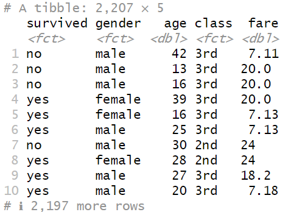

```{r setup, include=FALSE}
knitr::opts_chunk$set(echo = FALSE)
```

```{r echo=FALSE, eval=TRUE,message=FALSE, warning=FALSE}
library(tidyverse)
library(openintro)
library(knitr)
library(gridExtra)
library(ggmosaic)
data(COL)
seed <- 42
```

## Objectives

:::: {.column width=15%}
::::

:::: {.column width=70%}
- **Learn how to combine the `tidyverse` verbs and `ggplot2` geometries to visualize numerical and categorical data effectively**
- **Activity: Visualize Multiple Variables**
::::

:::: {.column width=15%}
::::

## Previously... (1/3)

**Chaining `dplyr` Verbs Using `%>%`**

**Load Packages**

```{r eval=TRUE, echo=TRUE, message=FALSE, warning=FALSE}
library(tidyverse)
```

**Define Data Frame as a Tibble**

```{r echo=TRUE, eval=TRUE}
iris_tibble <- tibble(iris)
```

**Advanced Example:** The goal of this example is to transform the `iris` dataset by computing the ratio of `Petal.Length` to `Sepal.Length` for observations belonging to the "setosa" species.

```{r echo=TRUE, eval=FALSE}
iris_tibble %>%  
  # rule 1: choose only the "setosa" species
  filter(Species == "setosa") %>%  
  # rule 2: pick the columns Sepal.Length and Petal.Length
  select(Sepal.Length,Petal.Length) %>%   
  # rule 3: create a new column called length_ratio
  mutate(length_ratio = Petal.Length/Sepal.Length)
```

## Previously... (2/3)

**Visualizing Numerical Data using `ggplot2`**

**Example:** Plotting lengths by species in the `iris` data set.

```{r echo=TRUE, eval=TRUE, fig.align='center', out.width='100%'}
# establish data and variables
ggplot(iris_tibble, 
       aes(x = Sepal.Length, 
           y = Petal.Length,
           color = Species)) +
  # draw scatter plot
  geom_point() + 
  # add theme layer
  theme_grey()
```

## Previously... (3/3)

**Descriptive statistics**

It involves organizing, summarizing, and presenting data in an informative way. It Focuses on describing and understanding the main features of a dataset.

:::: {.column width=49%}
**For Numerical Variables**

* Measures of Central Tendency
    - **<span style="color:blue;">Mean (Average)</span>**, **<span style="color:blue;">Median</span>**, and **<span style="color:blue;">Mode</span>**
* Measures of Dispersion (Spread)
    - **<span style="color:blue;">Range</span>**, **<span style="color:blue;">Variance</span>**, **<span style="color:blue;">Standard Deviation</span>**, **<span style="color:blue;">Interquartile Range (IQR)</span>**
::::

:::: {.column width=49%}
**For Categorical Variables**

* **<span style="color:blue;">Frequency</span>**
* **<span style="color:blue;">Relative Frequency (Proportion)</span>**
* **<span style="color:red;">Percentage</span>**
::::

## Case Study 1: Titanic Data Set

The the **Titanic Data Set** is a popular dataset in data science. It contains information about the passengers aboard the Titanic and is often used for survival prediction.

```{r echo=FALSE, eval=TRUE, message=FALSE, warning=FALSE}
# The titanic.csv data is from https://www.kaggle.com/datasets/aliaamiri/titanic-passengers-and-crew-complete-list
# The titanic data can also be accessed using the stablelearner package

titanic <- read_csv("titanic.csv") |> 
  select(survived,gender,age,class,fare) |> 
  mutate(age = round(age,0),
         class = case_when(
           class == "deck crew" ~ "crew",
           class == "engineering crew" ~ "crew",
           class == "restaurant staff" ~ "crew",
           class == "victualling crew" ~ "crew",
           TRUE ~ class
         ))
```

:::: {.column width=49%}
```{r titanic-sinking-illustration, echo=FALSE, fig.cap="The sinking of the Titanic illustration by Willy Stöwer", fig.align='center', out.width = '80%'}
knitr::include_graphics("Stower_Titanic.jpg")
```
::::

:::: {.column width=50%}
```{r titanic-data-matrix, echo=FALSE, fig.cap="The Titanic Data Matrix", fig.align='center', out.width = '80%'}

```
The number of observations in the data set is $2207$ passengers.
::::

## Contingency Tables

A table that summarizes data for two categorical variables is called a **contingency table**.

**Example:** The contingency table below shows the distribution of survival and different classes of passengers on the Titanic.

:::: {.column width=49%}

::::

:::: {.column width=70%}
```{r echo=FALSE, eval=TRUE, message=FALSE, warning=FALSE}
titanic_surv_class <- titanic |> select(survived,class) |> 
  group_by(survived,class) |> 
  summarise(total = n(),
            .groups = 'drop')
kable(addmargins(xtabs(total ~ survived + class, titanic_surv_class)))
```
::::

:::: {.column width=15%}
::::

## Contingency Tables: Using R

**Load Packages**

```{r echo=TRUE, eval=FALSE}
library(tidyverse)
library(knitr)
```

**Producing and presenting Contingency Tables in R**

```{r echo=TRUE, eval=FALSE, message=FALSE, warning=FALSE}
titanic_surv_class <- titanic %>% 
  select(survived,class) %>% 
  group_by(survived,class) %>% 
  summarise(total = n(),
            .groups = 'drop')
kable(addmargins(xtabs(total ~ survived + class, titanic_surv_class)))
```

## Row Proportions

For those who survived, what is the proportion of passenger class?

:::: {.column width=50%}
**Contingency Table:**

```{r echo=FALSE, eval=TRUE, message=FALSE, warning=FALSE}
titanic_surv_class <- titanic |> select(survived,class) |> 
  group_by(survived,class) |> 
  summarise(total = n(),
            .groups = 'drop')
kable(addmargins(xtabs(total ~ survived + class, titanic_surv_class)))
```
::::

:::: {.column width=49%}
To answer this question we examine the **row proportions**:

* *Survived 1st class passengers:* $\frac{201}{711} = 0.283$
* *Survived 2nd class passengers:* $\frac{118}{711} = 0.166$
* *Survived 3rd class passengers:* $\frac{181}{711} = 0.255$
* *Survived crew:* $\frac{211}{711} = 0.297$

There appears to be almost equal proportion of passenger class who survived. Note that this is only considering cases who survived.
::::

## Column Proportions

Does there appear to be a relationship between class and survival for passengers on the Titanic?

:::: {.column width=50%}
**Contingency Table:**

```{r echo=FALSE, eval=TRUE, message=FALSE, warning=FALSE}
titanic_surv_class <- titanic |> select(survived,class) |> 
  group_by(survived,class) |> 
  summarise(total = n(),
            .groups = 'drop')
kable(addmargins(xtabs(total ~ survived + class, titanic_surv_class)))
```
::::

:::: {.column width=49%}
To answer this question we examine the **column proportions**:

* *1st class passengers who survived:* $\frac{201}{324} = 0.620$
* *2nd class passengers who survived:* $\frac{118}{284} = 0.415$
* *3rd class passengers who survived:* $\frac{181}{709} = 0.255$
* *Crew who survived:* $\frac{211}{890} = 0.237$

The disproportionate survival of 1st class passengers suggests a relationship between class and survival.
::::

::: {style="color: red;"}
$\star$ **Key Idea:** Row and column proportions answer different questions and both are important. Row proportions show a near-equal passenger class split among survivors, while column proportions reveal a higher 1st class survival rate, reflecting the event when they prioritized the 1st class passengers for the life boats.
:::

## Bar Plots

A **bar plot** is a common way to display a single categorical variable. A bar plot where proportions instead of frequencies are shown is called a **relative frequency bar plot**.

```{r echo=FALSE, eval=TRUE, message=FALSE, warning=FALSE, fig.align='center', out.width='80%', fig.width=6,fig.height=3}
p1 <- ggplot(titanic,aes(x=survived)) + 
  geom_bar(fill=COL[1,1]) + 
  ggtitle("Frequencies") + 
  theme_minimal()
p2 <- ggplot(titanic,aes(x=survived)) + 
  geom_bar(aes(y=..count../sum(..count..)),fill=COL[1,1]) + 
  ylab("proportion") + 
  ggtitle("Relative Frequencies") + 
  theme_minimal()
grid.arrange(p1, p2, ncol=2)
```

## Bar Plots: Using R

**Load Packages**

```{r echo=TRUE, eval=FALSE}
library(tidyverse)
library(gridExtra)
```

**Plotting Bar Plots (raw Counts and Croportions)**

```{r echo=TRUE, eval=FALSE, message=FALSE, warning=FALSE, fig.align='center', out.width='80%', fig.width=6,fig.height=3}
p1 <- ggplot(titanic,aes(x=survived)) + 
  geom_bar(fill=COL[1,1]) + 
  ggtitle("Frequencies") + 
  theme_minimal()
p2 <- ggplot(titanic,aes(x=survived)) + 
  geom_bar(aes(y=..count../sum(..count..)),fill=COL[1,1]) + 
  ylab("proportion") + 
  ggtitle("Relative Frequencies") + 
  theme_minimal()
grid.arrange(p1, p2, ncol=2)
```

## Bar Plots vs Histograms

**How are bar plots different than histograms?**

:::: {.column width=10%}
::::

:::: {.column width=80%}
* **Bar Plots:** Show distributions of categorical variables
  - Categories can be arranged in any order
  - Useful for nominal and ordinal data

* **Histograms:** Show distributions of numerical variables
  - The x-axis is a number line, so the order is fixed
  - Used for continuous or discrete numerical data
::::

:::: {.column width=10%}
::::

## Bar Plots with Two Variables

**Bar plots** are graphical representations of categorical data using rectangular bars of varying heights.

:::: {.column width=49%}
**Features:**

* Represents discrete categories
* Bar height corresponds to frequency or value
* Can be vertical or horizontal
::::

:::: {.column width=50%}
**Types of Bar Plots:**

* **Stacked bar plot:** Graphical display of contingency table information,
for counts.

* **Side-by-side bar plot:** Displays the same information by placing bars 
next to, instead of on top of, each other.

* **Standardized stacked bar plot:** Graphical display of contingency table 
information, for proportions.
::::

## Examples of Bar Plots

The following bar plots still uses the `geom_bar()` layer but with defined parameter option `position`.

```{r echo=FALSE, eval=TRUE, message=FALSE, warning=FALSE, fig.align='center', out.width='100%', fig.width=12,fig.height=4}
p1 <- ggplot(titanic,aes(x=class,fill=survived)) + 
  geom_bar() + 
  scale_fill_manual(values=c("yes" = COL[1,1], "no" = COL[1,4])) + 
  ggtitle("Stacked (default)") + 
  theme_minimal()
p2 <- ggplot(titanic,aes(x=class,fill=survived)) + 
  geom_bar(position="dodge") + 
  scale_fill_manual(values=c("yes" = COL[1,1], "no" = COL[1,4])) + 
  ggtitle("Side-by-Side (position='dodge')") + 
  theme_minimal()
p3 <- ggplot(titanic,aes(x=class,fill=survived)) + 
  geom_bar(position="fill") + 
  scale_fill_manual(values=c("yes" = COL[1,1], "no" = COL[1,4])) + 
  ggtitle("Standardized (position='fill')") + 
  theme_minimal()
grid.arrange(p1, p2, p3, ncol=3)
```

::: {style="color: red;"}
$\star$ **Key Idea:** Each visualization provides a different perspective: Stacked helps compare total passengers across classes. Side-by-Side helps compare survival counts directly. Standardized helps compare survival rates across classes.
::::

## Mosaic Plots

A **mosaic plot** is a graphical representation of categorical data, displaying proportions and relationships between multiple categorical variables using a tiled area chart.

:::: {.column width=49%}
```{r echo=FALSE, eval=TRUE, message=FALSE, warning=FALSE, fig.align='center', out.width='100%', fig.width=4,fig.height=4}
ggplot(titanic) + 
  geom_mosaic(aes(x=product(class,survived), fill = survived)) + 
  scale_fill_brewer(palette = 1) +
  theme_mosaic() + 
  theme(legend.position = "none")
```
::::

:::: {.column width=50%}
**Features:** 

* Each tile represents a combination of categories from two or more categorical variables.
* The area of each tile is proportional to the frequency or probability of that combination.
* Provides an intuitive way to analyze relationships, such as independence or associations between categorical variables.
::::

## Mosaic Plots: Using R

**Load Packages**

```{r echo=TRUE, eval=FALSE}
library(tidyverse)
library(ggmosiac)
```

**Visualizing Categorical Variables using a Mosaic Plot**

```{r echo=TRUE, eval=TRUE, message=FALSE, warning=FALSE, fig.align='center', out.width='100%', fig.width=4,fig.height=4}
ggplot(titanic) + 
  geom_mosaic(aes(x=product(class,survived), fill = survived)) + 
  scale_fill_brewer(palette = 1) +
  theme_mosaic() + 
  theme(legend.position = "none")
```

## Pie Charts

A **pie chart** is a circular statistical graphic divided into slices to illustrate numerical proportions of a whole.

:::: {.column width=50%}
**Features:** 

* Each slice represents a category’s proportion relative to the whole dataset.
* The total sum of all slices equals 100%.
* Useful for showing part-to-whole relationships.
::::

:::: {.column width=49%}
```{r echo=FALSE, eval=TRUE, message=FALSE, warning=FALSE, fig.align='center', out.width='100%', fig.width=5,fig.height=5}
p1 <- ggplot(titanic |> filter(class=="1st"), aes(x="", y=survived, fill=survived)) +
  geom_bar(stat="identity", width=1) +
  scale_fill_brewer(palette = 1) +
  coord_polar("y", start=0) + 
  ggtitle("1st Class") + 
  theme_void()
p2 <- ggplot(titanic |> filter(class=="2nd"), aes(x="", y=survived, fill=survived)) +
  geom_bar(stat="identity", width=1) +
  scale_fill_brewer(palette = 1) +
  coord_polar("y", start=0) + 
  ggtitle("2nd Class") + 
  theme_void()
p3 <- ggplot(titanic |> filter(class=="3rd"), aes(x="", y=survived, fill=survived)) +
  geom_bar(stat="identity", width=1) +
  scale_fill_brewer(palette = 1) +
  coord_polar("y", start=0) + 
  ggtitle("3rd Class") + 
  theme_void()
p4 <- ggplot(titanic |> filter(class=="crew"), aes(x="", y=survived, fill=survived)) +
  geom_bar(stat="identity", width=1) +
  scale_fill_brewer(palette = 1) +
  coord_polar("y", start=0) + 
  ggtitle("Crew") + 
  theme_void()
grid.arrange(p1, p2, p3, p4, nrow=2, ncol=2)
```
::::

## Pie Charts: Using R

**Load Packages**

```{r echo=TRUE, eval=FALSE}
library(tidyverse)
```

**Visualizing Categorical Variables using Pie Charts**

```{r echo=TRUE, eval=FALSE, message=FALSE, warning=FALSE, fig.align='center', out.width='100%', fig.width=5,fig.height=5}
ggplot(titanic %>% filter(class=="1st"), aes(x="", y=survived, fill=survived)) +
  geom_bar(stat="identity", width=1) +
  scale_fill_brewer(palette = 1) +
  coord_polar("y", start=0) + 
  ggtitle("1st Class") + 
  theme_void()
```

## Comparing Categorical Data to Numerical Data

**Example:** Age distribution among class passengers and survival. 

```{r echo=FALSE, eval=TRUE, message=FALSE, warning=FALSE, fig.align='center', out.width='80%', fig.width=8,fig.height=4}
ggplot(titanic,aes(y=class,x=age, fill=survived)) + 
  geom_boxplot() + 
  scale_fill_brewer(palette = "Set2") +
  theme_minimal()
```

::: {style="color: red;"}
$\star$ The boxplot visually compares the spread, median, and possible outliers of age distributions among different classes while distinguishing survival status using color. This helps in analyzing whether age and class had an impact on survival rates on the Titanic.
::::

## Comparing Categorical Data to Numerical Data: Using R

**Load Packages**

```{r echo=TRUE, eval=FALSE}
library(tidyverse)
```

**Visualizing Multiple Variables**

```{r echo=TRUE, eval=FALSE, message=FALSE, warning=FALSE, fig.align='center', out.width='80%', fig.width=8,fig.height=4}
ggplot(titanic,aes(y=class,x=age, fill=survived)) + 
  geom_boxplot() + 
  scale_fill_brewer(palette = "Set2") +
  theme_minimal()
```

## Activity: Visualize Multiple Variables

1. Log-in to Posit Cloud and open the R Studio assignment *W 2/26 - Visualize Multiple Variables Techniques*.
2. Make sure you are in the current working directory. Rename the `.Rmd` file by replacing `[name]` with your name using the format `[First name][Last initial]`. Then, open the `.Rmd` file.
3. Change the author in the YAML header.
4. Read the provided instructions.
5. Answer all exercise problems on the designated sections.

## References

::: {#refs}
:::
