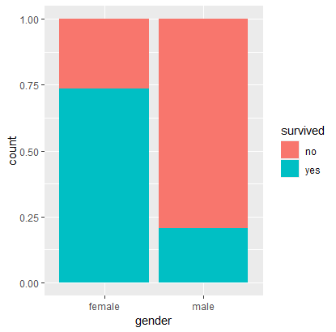
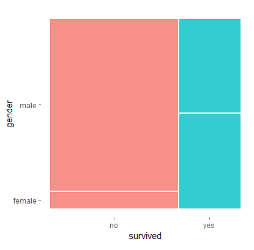
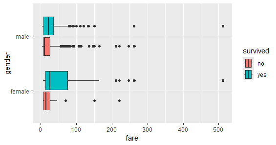

```{r setup, include=FALSE}
knitr::opts_chunk$set(echo = TRUE)
```

# Syllabus Reminders

- You must submit your worksheet individually by end-of-class or end-of-day. Your name must exist in your worksheet and the names of your collaborators.
- Worksheets are marked mostly on completion, and partially on correctness. It will be marked either pass or fail, there will no detailed feedback on worksheets, and no opportunities for revisions and make-up.

# Instructions

- For the exercises, please provide your answers in full sentences.
- Write your answers by replacing the text "[Write your answer here]".
- Whenever a problem asks you to run something in R, create an R code chunk and write your R commands inside that chunk.
- If a problem requires modifying an existing R code chunk, make the necessary changes at the appropriate lines within the given code.
- Please read the problems fully and carefully before answering.
- When finished, knit this `.Rmd` to `.html`.
- Submit this `.Rmd` and the recently knitted `.html` to Moodle.

# Packages

The following R packages have already been loaded for you, so there's no need to load them yourself—they will be used in the problem sets. If you need any additional packages, you can load them here as well.

```{r message=FALSE, warning=FALSE}
# load packages
library(tidyverse)
library(ggmosaic)
library(knitr)
```

# Collaborators

::: {style="color: blue;"}
[Write your answer here]
:::

# Exercises

## Problem 1

Load the `titanic.csv` data set using the `read_csv()` function, then store it to a R variable.

::: {style="color: blue;"}
[Write your answer here]
:::

## Problem 2

Examine the Titanic data set and create a contingency table that represents the number of survived and non survived males and females.

::: {style="color: blue;"}
[Write your answer here]
:::

## Problem 3

Use `geom_bar()` and `geom_mosaic()` to replicate the following two plots, which is the proportion of survived males and females compared to not survived male and females.

```{r echo=FALSE, fig.align='center', out.width = "40%"}
# Plot 1

```

```{r echo=FALSE, fig.align='center', out.width = "40%"}
# Plot 2

```

::: {style="color: blue;"}
[Write your answer here]
:::

## Problem 4

Use the `geom_boxplot()` to replicate the following plot, which shows the `fare` variable comparing different genders and survival.

```{r echo=FALSE, fig.align='center', out.width = "80%"}

```

::: {style="color: blue;"}
[Write your answer here]
:::

## Problem 5

Generate a plot that shows the `age` variable comparing different genders and survival.

::: {style="color: blue;"}
[Write your answer here]
:::
