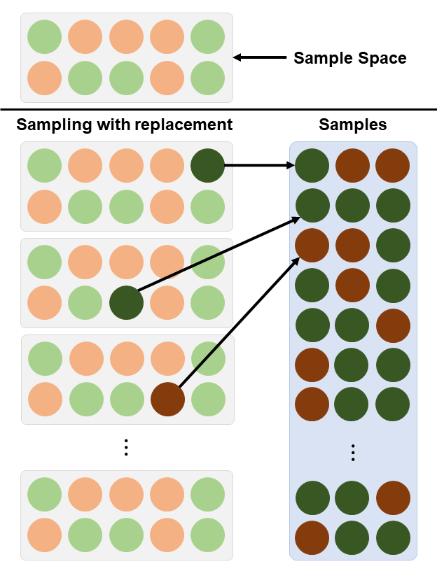
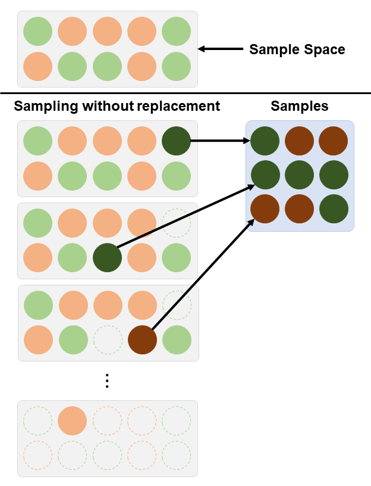

```{r setup, include=FALSE}
knitr::opts_chunk$set(echo = FALSE)
```

```{r echo=FALSE, eval=TRUE,message=FALSE, warning=FALSE}
library(tidyverse)
library(openintro)
library(gghighlight)
library(latex2exp)
data(COL)
seed <- 42
```

## Objectives

:::: {.column width=15%}
::::

:::: {.column width=70%}
- **Introduce conditional probability**
- **Develop an understanding of dependent events**
- **Know how to compute conditional probabilities**
- **Activity: Balls in Urns Problem**
::::

:::: {.column width=15%}
::::

## Previously... (1/2)

**Basic Probability Rules**

| **Rule** | **Formula** |
|:---|:------|
| *Independence* | $P(A \cap B) = P(A)P(B)$ |
| *Joint (Union)* | $P(A \cup B) = P(A) + P(B) - P(A \cap B)$ |
| *Disjoint* | $P(A \cap B) = 0$ |
| *Complement* | If $P(A) + P(B) = 1$, then $1-P(A)=P(B)$. |

## Previously... (2/2)

| **Axiom** | **Statement** |
|:---|:------|
| $P(S) = 1$ | The sum of the probabilities for all outcomes in the sample space is equal to 1. |
| $P \in [0,1]$ | Probabilities are always positive and always between $0$ and $1$. |
| $P(A \cup B) = P(A) + P(B)$ | If events A and B are disjoint (mutually exclusive), then their probabilities can be added. |

## Sampling with Replacement

**Sampling with replacement** is a sampling method where each selected unit is returned to the population before the next selection. Each selection is independent of previous selection.

:::: {.column width=50%}
**Characteristics:**

* The population remains unchanged after each selection.
* Each item can be chosen more than once.
* Items are independently chosen with the same probability.
::::

:::: {.column width=49%}
```{r sampling-with-replacement, echo=FALSE, fig.cap="", out.width="70%", fig.align="center"}

```
::::

## Sampling without Replacement

**Sampling without replacement** is a sampling method where each selected unit is not returned to the population before the next draw. Each selection depends on previous selections, as the population size decreases.

:::: {.column width=50%}
**Characteristics:**

* The population changes after each selection.
* Each item can be chosen only once.
* Items are dependently chosen with changing probability.
::::

:::: {.column width=49%}
```{r sampling-without-replacement, echo=FALSE, fig.cap="", out.width="70%", fig.align="center"}

```
::::

## With vs Without Replacement

| **Feature** | **Sampling with Replacement** | **Sampling without Replacement** |
|:---|:---|:---|
| _Independence_ | Yes | No |
| _Duplication_ | Yes | No |
| _Changing Sample Space_ | No | Yes |

## Drawing Cards


## Conditional Probability


## Balls in Urns Problem (Part 1/2)


## Balls in Urns Problem (Part 2/2)


## Bayes' Rule


## Activity: Balls in Urns Problem


## References

::: {#refs}
:::
